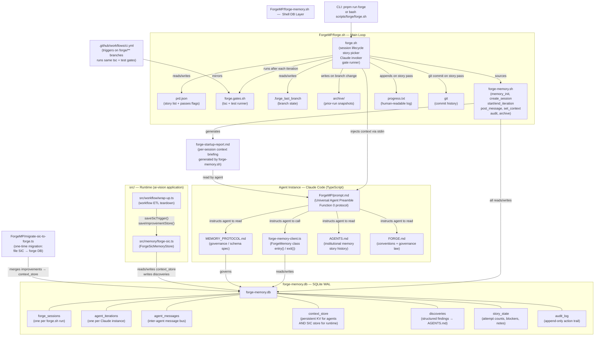

# ForgeMP Modules

**Project:** ai-vision  
**Date:** 2026-04-23  
**Branch:** forge/v2-orchestrator

---

## Module Inventory

| Module | Path | Role |
|---|---|---|
| **forge.sh** | `ForgeMP/forge.sh` | Main runner — session lifecycle, agent loop, gates |
| **forge-memory.sh** | `ForgeMP/forge-memory.sh` | SQLite shell layer — sourced by forge.sh; all DB ops |
| **forge-memory.db** | `forge-memory.db` (gitignored) | Stateful SQLite DB; 7 tables; WAL mode |
| **forge-memory-client.ts** | `ForgeMP/forge-memory-client.ts` | TypeScript DB client for agents (entry/exit protocol) |
| **MEMORY_PROTOCOL.md** | `ForgeMP/MEMORY_PROTOCOL.md` | Governance law — DB schema rationale, mandatory obligations |
| **prompt.md** | `ForgeMP/prompt.md` | Universal Agent Preamble injected into every Claude invocation |
| **FORGE.md** | `FORGE.md` | Project conventions, governance law, DB protocol link |
| **AGENTS.md** | `AGENTS.md` | Institutional memory — patterns, gotchas, story history |
| **forge.gates.sh** | `forge.gates.sh` | Quality gate runner (`tsc --noEmit`, `npm test`) |
| **forge.gates.example.sh** | `ForgeMP/forge.gates.example.sh` | Gate template/reference |
| **prd.json** | `prd.json` | Story task list; `passes` booleans; branch name |
| **progress.txt** | `progress.txt` | Append-only human-readable build log |
| **.forge_last_branch** | `.forge_last_branch` | State file — tracks active branch to detect archive triggers |
| **forge-sic.ts** | `src/memory/forge-sic.ts` | Runtime SIC→FORGE bridge; reads/writes `context_store` in forge-memory.db |
| **migrate-sic-to-forge.ts** | `ForgeMP/migrate-sic-to-forge.ts` | One-time migration; merges file-based SIC improvements → forge DB |
| **wrap-up.ts** | `src/workflow/wrap-up.ts` | Workflow ETL teardown; calls `forgeSicStore.saveSicTrigger()` |
| **ci.yml** | `.github/workflows/ci.yml` | CI — same gates as forge.gates.sh; triggers on `forge/**` branches |

---

## SQLite DB Schema (`forge-memory.db`)

| Table | Purpose |
|---|---|
| `forge_sessions` | One row per `forge.sh` invocation; tracks branch, project, iteration budget |
| `agent_iterations` | One row per Claude Code instance; execution ledger with gate results |
| `agent_messages` | Inter-agent message bus (DISCOVERY, BLOCKER, HANDOFF, WARNING, STATUS, DECISION) |
| `context_store` | Persistent KV store — survives context windows; also stores SIC improvements from runtime |
| `discoveries` | Structured findings (PATTERN, GOTCHA, BLOCKER, DECISION, DEPENDENCY, CONVENTION) → feeds AGENTS.md |
| `story_state` | Extended story state: attempt count, last error, active blockers, context notes |
| `audit_log` | Immutable append-only record of every significant FORGE action |

---

## Architecture Diagram

---

## Data Flow Summary

Compatibility note:
- The canonical implementation lives under `ForgeMP/`.
- `scripts/forge/` contains compatibility entrypoints for older handoffs and docs.

### Build-time (Shell → DB → Claude → DB → Gates)

1. `forge.sh` starts → sources `forge-memory.sh` → initializes `forge-memory.db` schema (WAL mode, all 7 tables)
2. Memory layer writes a `forge_sessions` row and generates `forge-startup-report.md`
3. `forge.sh` picks the next failing story from `prd.json`, injects `prompt.md` + context into Claude via stdin
4. Claude calls `ForgeMemory.entry()` → reads `agent_messages`, `story_state`, `context_store` (Function 0 gate)
5. Claude implements the story → calls `ForgeMemory.exit()` → writes `discoveries`, `context_store`, closes `agent_iterations` row
6. `forge.sh` runs `forge.gates.sh` → if gates pass: marks story `passes: true` in `prd.json`, appends `progress.txt`, commits git

### Runtime (Application → Forge DB)

- `wrap-up.ts` calls `ForgeSicMemoryStore.saveSicTrigger()` after each workflow run
- `forge-sic.ts` writes to `context_store` and `discoveries` in `forge-memory.db`
- This bridges live workflow learnings (SIC triggers, improvement store) into the same DB that agents read during the next build session — closing the build/run feedback loop

### CI

- `.github/workflows/ci.yml` triggers on `forge/**` branches
- Runs the identical typecheck (`tsc --noEmit`) + test gates as `forge.gates.sh`
- Ensures the same quality bar is enforced in both local FORGE runs and remote CI

---

## Key Governance Rules

- `forge-memory.db` must exist and pass a health check before any agent runs (`forge.sh` enforces this)
- Every agent must call `mem.entry()` before writing code and `mem.exit()` after quality gates
- All inter-agent communication flows through `agent_messages`; no out-of-band state
- Runtime SIC writes target `context_store` in FORGE DB — not flat files or the app SQLite DB
- `AI_VISION_SIC_FORGE_STRICT=true` (default) causes `ForgeSicMemoryStore` to throw if the DB or `context_store` table is absent
- `forge-memory.db` is gitignored; `progress.txt` and `AGENTS.md` are the human-readable audit surfaces
