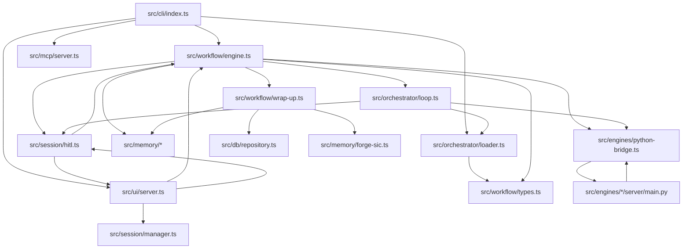
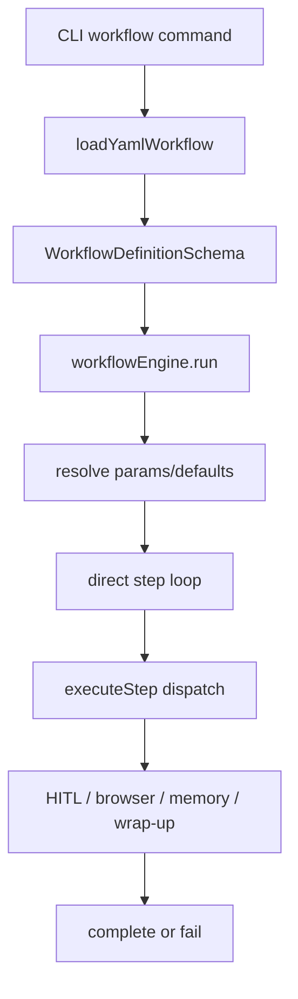
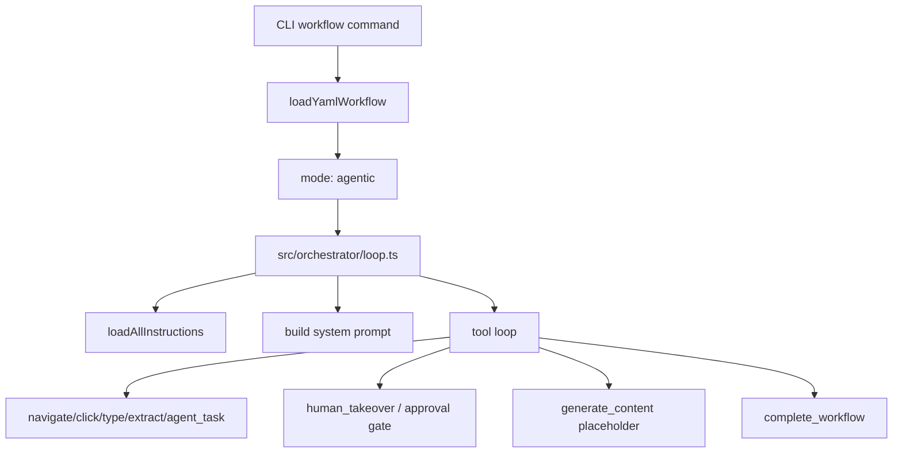
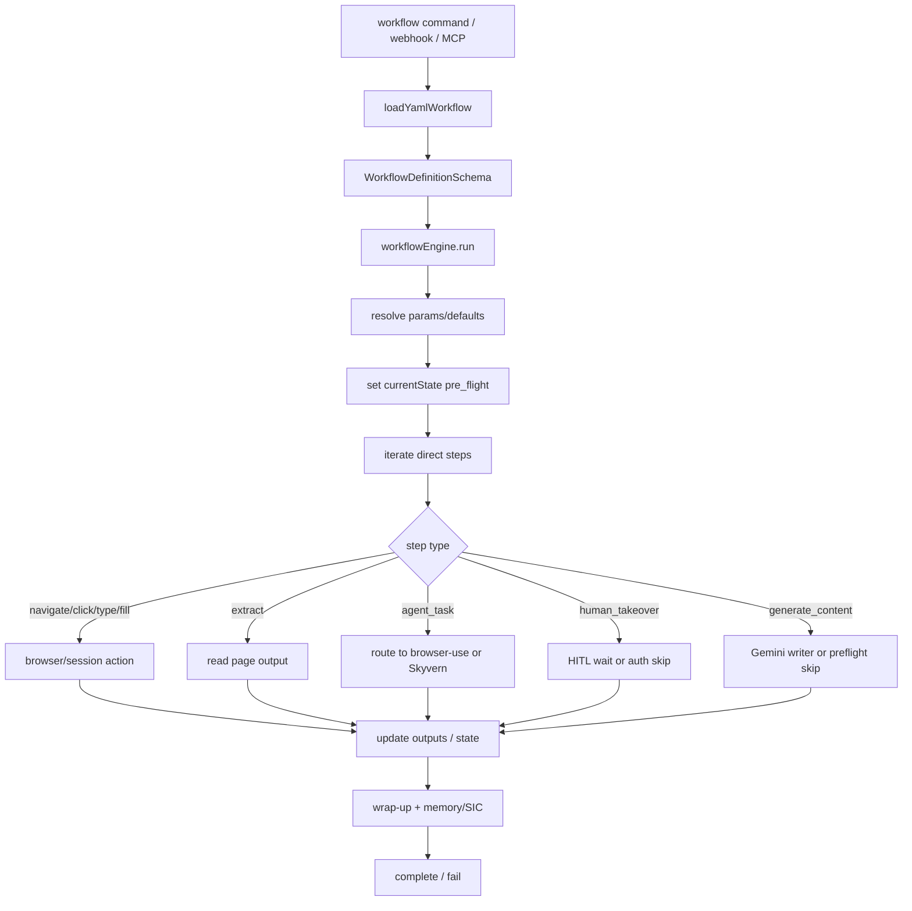
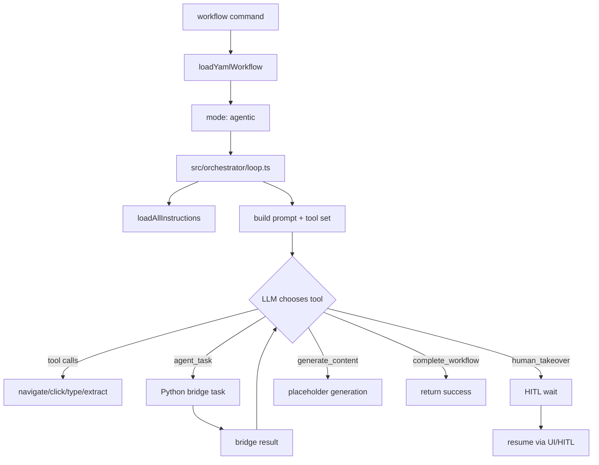
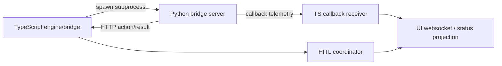
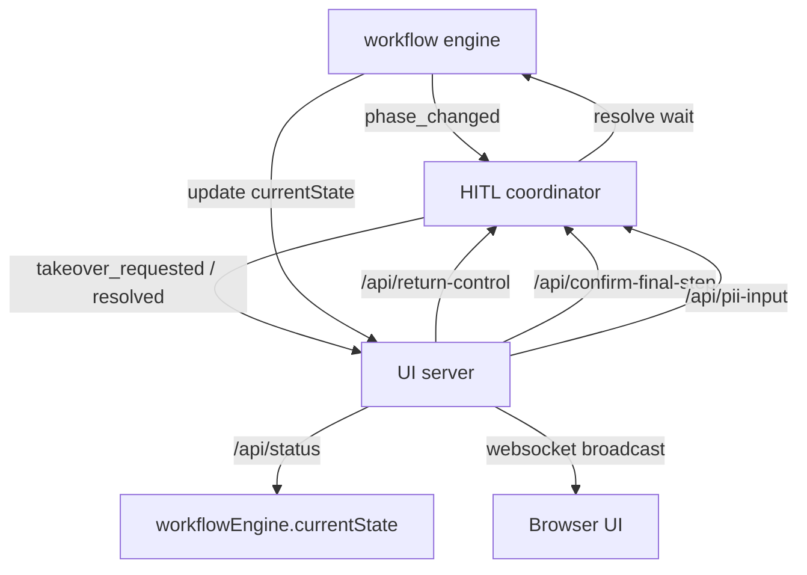
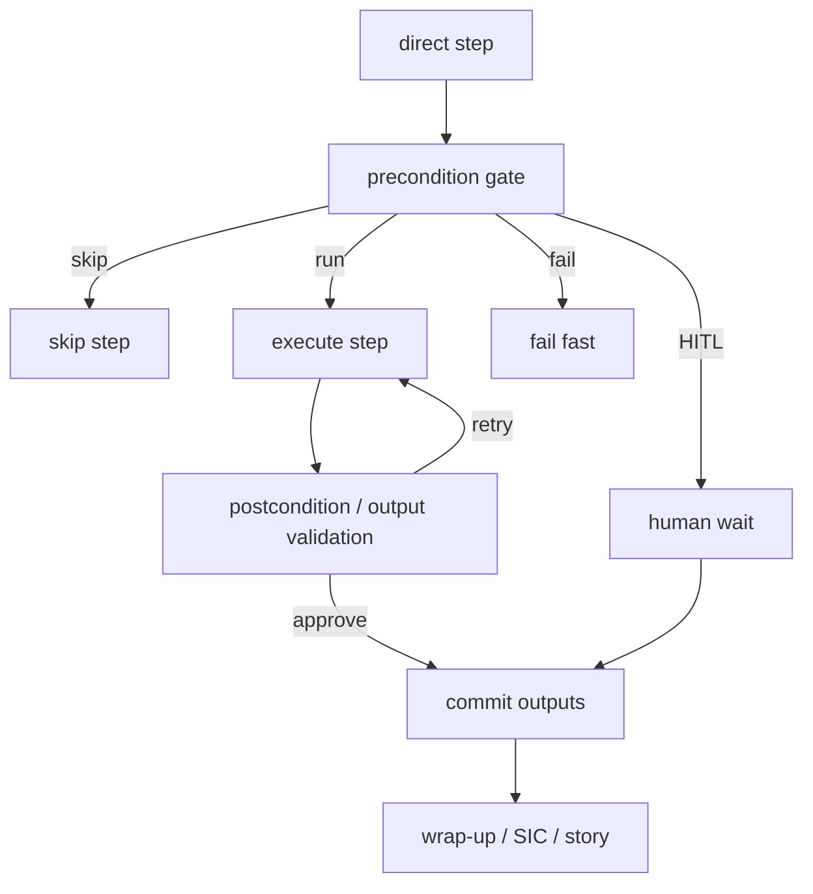

# As-Built Execution Atlas

**Project:** ai-vision  
**Date:** 2026-04-24  
**Scope:** Discovery only. No runtime changes.
**Last Updated:** 2026-05-03 (reconciled with US-042 screenshot retention flow)

This document maps the current as-built execution topology of `ai-vision` across TypeScript, Python, YAML, UI, HITL, browser automation, memory/story/SIC, tests, and docs.

## A. Executive Summary

`ai-vision` is already a layered system, but it is not a single unified kernel.

The current production shape is:

- **TypeScript** owns the application kernel: CLI, workflow orchestration, HITL state publication, UI, session coordination, telemetry, memory persistence, and runtime routing.
- **Python** owns the execution-heavy browser automation engines and the language-model-facing bridge servers.
- **YAML** defines workflow intent and step declarations.
- **browser-use / Skyvern** act as bounded automation workers behind the Python bridge.
- **HITL/HACC** is the human decision plane for takeover, secure input, approval, and QA pauses.
- **Story/SIC** is the learning and improvement sink during wrap-up.

The direct workflow path in `src/workflow/engine.ts` is the real runtime kernel today. The agentic path in `src/orchestrator/loop.ts` is a separate outer planner that adds flexibility, but it also splits semantics around approval, output generation, and execution determinism. The as-built system therefore has a partially coherent direct kernel plus a parallel orchestration path that should be treated as quarantined, not as the primary production model.

The important discovery is not “TS versus Python” by itself. The important discovery is that **TypeScript is the stateful runtime coordinator, Python is the task executor, and the workflow engine is already the best place to host explicit gates**. The direct path already contains some useful gates:

- deterministic auth verification skip logic
- secure input pause logic
- final confirmation pause logic
- editorial draft approval pause logic
- output preflight skip logic for generated content

What is missing is a generalized gate layer that can replace the hidden flexibility the agentic planner currently provides without reintroducing nondeterministic outer planning.

## B. Layer Map

### 1. CLI layer

- **Role:** User entrypoint for `run`, `serve`, `workflow`, `history`, `engines`, `config`
- **Primary files:** [`src/cli/index.ts`](/home/spoq/ai-vision/src/cli/index.ts)
- **Shape:** command dispatcher, bootstrapper, terminal process owner
- **Triggers:** direct CLI invocation

### 2. YAML workflow loading layer

- **Role:** load built-in and YAML workflows, resolve definitions, expose listings
- **Primary files:** [`src/orchestrator/loader.ts`](/home/spoq/ai-vision/src/orchestrator/loader.ts), [`workflows/*.yaml`](/home/spoq/ai-vision/workflows)
- **Shape:** loader, registry, schema boundary
- **Triggers:** `workflow` CLI command, orchestration bootstrap, YAML discovery

### 3. Workflow schema/type layer

- **Role:** define workflow definitions, steps, permissions, outputs, hitl contracts
- **Primary files:** [`src/workflow/types.ts`](/home/spoq/ai-vision/src/workflow/types.ts)
- **Shape:** schema boundary, static contract surface
- **Triggers:** YAML parse, CLI run, runtime validation

### 4. Direct workflow engine layer

- **Role:** execute workflow steps deterministically, maintain runtime state, publish HITL/UI state, wrap up sessions
- **Primary files:** [`src/workflow/engine.ts`](/home/spoq/ai-vision/src/workflow/engine.ts)
- **Shape:** state machine, dispatcher, loop, gate host
- **Triggers:** CLI workflow run, webhook trigger, MCP workflow_run, internal workflow chaining

### 5. Agentic/orchestrator layer

- **Role:** outer Claude planner, instruction loader, tool-call executor, permission gate manager
- **Primary files:** [`src/orchestrator/loop.ts`](/home/spoq/ai-vision/src/orchestrator/loop.ts)
- **Shape:** planner loop, tool dispatcher, prompt assembler
- **Triggers:** YAML workflows with `mode: agentic`

### 6. TypeScript UI/server layer

- **Role:** HITL web UI, status projection, screenshot viewer, control endpoints, websocket broadcaster
- **Primary files:** [`src/ui/server.ts`](/home/spoq/ai-vision/src/ui/server.ts)
- **Shape:** HTTP server, websocket event sink, state projection, control surface
- **Triggers:** workflow state changes, HITL waits, browser-use events, user actions

### 7. HITL/session layer

- **Role:** blocking human wait coordinator for takeover, secure input, final confirmation, QA pause
- **Primary files:** [`src/session/hitl.ts`](/home/spoq/ai-vision/src/session/hitl.ts), [`src/session/types.ts`](/home/spoq/ai-vision/src/session/types.ts), [`src/session/manager.ts`](/home/spoq/ai-vision/src/session/manager.ts)
- **Shape:** blocking wait, event emitter, state owner
- **Triggers:** direct engine gates, agentic planner tool calls, UI endpoints

### 8. Python intelligence layer

- **Role:** run browser automation engines and bridge servers; expose runtime actions over HTTP
- **Primary files:** [`src/engines/python-bridge.ts`](/home/spoq/ai-vision/src/engines/python-bridge.ts), [`src/engines/browser-use/engine.ts`](/home/spoq/ai-vision/src/engines/browser-use/engine.ts), [`src/engines/skyvern/engine.ts`](/home/spoq/ai-vision/src/engines/skyvern/engine.ts), [`src/engines/browser-use/server/main.py`](/home/spoq/ai-vision/src/engines/browser-use/server/main.py), [`src/engines/skyvern/server/main.py`](/home/spoq/ai-vision/src/engines/skyvern/server/main.py)
- **Shape:** subprocess bridge, HTTP adapter, bounded worker
- **Triggers:** `agent_task`, explicit engine selection, browser-use navigation/action requests

### 9. Browser-use bridge layer

- **Role:** browser-use event/server boundary and callback publication back to TypeScript
- **Primary files:** [`src/engines/python-bridge.ts`](/home/spoq/ai-vision/src/engines/python-bridge.ts), [`src/engines/browser-use/server/main.py`](/home/spoq/ai-vision/src/engines/browser-use/server/main.py)
- **Shape:** bridge, callback sink, live telemetry source
- **Triggers:** browser-use step execution, step callbacks, browser action events

### 10. Browser automation/tool adapter layer

- **Role:** Playwright-like browser actions exposed through TS engine abstraction and Python bridge
- **Primary files:** [`src/engines/interface.ts`](/home/spoq/ai-vision/src/engines/interface.ts), [`src/engines/registry.ts`](/home/spoq/ai-vision/src/engines/registry.ts)
- **Shape:** adapter, registry, tool-call surface
- **Triggers:** workflow steps, MCP browser tools, CLI `run`

### 11. Memory/story/SIC layer

- **Role:** persistence and learning surface for short-term memory, stories, improvements, and SIC triggers
- **Primary files:** [`src/memory/short-term.ts`](/home/spoq/ai-vision/src/memory/short-term.ts), [`src/memory/long-term.ts`](/home/spoq/ai-vision/src/memory/long-term.ts), [`src/memory/forge-sic.ts`](/home/spoq/ai-vision/src/memory/forge-sic.ts), [`src/workflow/wrap-up.ts`](/home/spoq/ai-vision/src/workflow/wrap-up.ts)
- **Shape:** persistence sink, learning pipeline, correlation layer
- **Triggers:** wrap-up, rejection handling, improvement capture, MCP memory tools
- **Screenshot retention note:** As of `US-042` / `RF-024`, [`src/session/screenshot-retention.ts`](/home/spoq/ai-vision/src/session/screenshot-retention.ts) owns both immediate retention policy cleanup and delayed successful-run cleanup. Successful runs now retain rolling/debug screenshots for a bounded `120000ms` post-task window after the rolling timer stops, then delete them through a retry-with-backoff path; startup recovery consults SQLite `workflow_runs` success state to delete expired successful-run rolling files when the timer was lost, while failed/aborted debug frames remain under `ttl_24h` and evidence/manual-review screenshots stay preserved.
- **Screenshot evidence audit note:** Evidence screenshots receive stable evidence ids and capture-time content hashes. SQLite `screenshot_evidence_audit` records who/what/when/why/action/path/hash metadata without screenshot bytes, and evidence deletion moves through `pending_deletion` before `deleted` or `delete_failed`.
- **Screenshot persistence note:** As of `US-037` / `RF-019`, wrap-up sanitizes new durable screenshot writes before they reach SQLite `workflow_runs.result_json` or wrap-up artifact JSON. In-process `WorkflowResult` objects remain unchanged until that durable boundary.

### 12. Test layer

- **Role:** encode workflow, engine, HITL, bridge, UI, and memory assumptions
- **Primary files:** `*.test.ts`, `*.spec.ts` in `src/`
- **Shape:** guardrail set, regression detector
- **Triggers:** CI, local validation, workflow refactor verification

### 13. Documentation/artifact layer

- **Role:** repository knowledge, traces, build notes, architecture cartography, SIC tracker
- **Primary files:** `docs/**`, `progress.txt`, `FORGE.md`, `AGENTS.md`
- **Shape:** artifact store, operational memory, handoff surface
- **Triggers:** story completion, discovery work, architecture changes

## C. Shape Map

| Layer | Shape | Notes |
| --- | --- | --- |
| CLI | command dispatcher, bootstrapper | Starts process graph and selects runtime mode |
| YAML loader | registry, parser, schema boundary | Converts declared workflows into runtime definitions |
| Workflow schema | schema boundary | Defines allowed step types, permissions, outputs, modes |
| Direct engine | state machine, dispatcher, loop | Main production kernel; owns runtime state and wrap-up |
| Agentic orchestrator | planner loop, tool dispatcher | Hidden outer LLM planner; separate semantics |
| UI/server | HTTP server, websocket sink, projection | Mirrors workflow state for humans and status polling |
| HITL/session | blocking wait, event emitter | Pauses execution for human actions |
| Python layer | subprocess bridge, HTTP adapter, worker | Runs browser-use/Skyvern tasks and returns results |
| Browser-use bridge | bridge, callback source | Emits live browser-use action events |
| Automation adapter | registry, adapter, tool surface | Standardizes browser actions behind engine interface |
| Memory/story/SIC | persistence sink, correlation pipeline | Converts run evidence into stories and SIC triggers |
| Test layer | regression detector | Verifies path-specific behavior and safety |
| Docs/artifacts | knowledge base | Captures design intent, traces, and operational lessons |

## D. Connection Graph

### High-level adjacency



### TypeScript -> TypeScript

- `src/cli/index.ts` → `src/workflow/engine.ts`, `src/ui/server.ts`, `src/mcp/server.ts`, `src/orchestrator/loader.ts`
- `src/workflow/engine.ts` → `src/session/hitl.ts`, `src/workflow/wrap-up.ts`, `src/memory/*`, `src/engines/*`, `src/orchestrator/loop.ts`
- `src/ui/server.ts` → `src/workflow/engine.ts`, `src/session/hitl.ts`, `src/session/manager.ts`, `src/engines/python-bridge.ts`
- `src/mcp/server.ts` → workflow engine, browser engine adapters, memory modules, telemetry modules
- `src/orchestrator/loop.ts` → HITL coordinator, browser engines, instruction loader, workflow types

### TypeScript -> Python

- `src/engines/python-bridge.ts` launches Python bridge subprocesses and calls them over HTTP
- `src/engines/browser-use/engine.ts` and `src/engines/skyvern/engine.ts` configure the bridge

### Python -> browser-use calls

- Python bridge server modules expose browser actions and task execution
- browser-use emits callback events back to TypeScript via the callback URL

### UI/server -> workflow engine state reads

- `/api/status` reads `workflowEngine.currentState`
- screenshot polling uses current state if present
- websocket payloads mirror state and bridge events

### HITL coordinator -> UI/status/event connections

- HITL methods emit phase changes that the UI broadcasts
- UI endpoints call HITL resolution methods
- engine writes state, HITL owns waits

### workflow engine -> memory/story/SIC

- preflight memory lookup
- short-term memory begin/clear
- wrap-up story creation
- SIC trigger creation
- long-term persistence and metadata indexing

### YAML workflow -> schema -> runtime execution path

- YAML file → loader → `WorkflowDefinitionSchema` → direct engine or orchestrator loop

### direct path vs agentic path

- direct path runs `src/workflow/engine.ts`
- agentic path runs `src/orchestrator/loop.ts`
- the split exists only for YAML workflows with `mode: agentic`

### browser-use telemetry -> TypeScript status/UI path

- browser-use callback events arrive through the TS bridge
- TS bridge emits browser action events to UI websocket
- UI displays them alongside workflow state and screenshots

## E. Trigger Map

| Trigger | Primary subsystem | Resulting action |
| --- | --- | --- |
| CLI `run` | CLI, engine registry | Starts one-shot prompt execution |
| CLI `serve` | UI server, MCP, webhook server | Starts HITL/control plane |
| CLI `workflow` | YAML loader, workflow engine | Runs a declared workflow |
| YAML workflow execution | workflow engine / orchestrator loop | Parses and dispatches declared steps |
| Browser event | Python bridge, UI | Emits action telemetry and live status |
| HITL request | HITL coordinator, UI | Pauses execution for human action |
| QA pause | workflow engine, HITL coordinator | Publishes `hitl_qa` and captures notes or approval |
| Approval requirement | orchestrator loop or direct gate | Blocks until approved or rejects run |
| PII secure input | direct engine type step | Switches to secure input wait |
| Auth verification | direct engine human_takeover step | Skips or requests login takeover |
| Content generation | direct engine `generate_content` or orchestrator placeholder generator | Produces title/body outputs |
| Browser-use task | agent_task routing | Delegates to browser-use or Skyvern |
| Workflow completion | engine and wrap-up | Finalizes state, persists run, closes session |
| Failure | engine error path, wrap-up | Marks failed, records reason, may open QA pause |
| Story/SIC write | wrap-up / memory | Persists learning artifacts |
| Websocket/status update | UI server | Broadcasts current workflow and HITL state |
| Screenshot timer | engine/session manager/UI | Refreshes screenshot stream while active |

## F. State Ownership Map

### 1. `workflowEngine.currentState`

- **Writer:** `src/workflow/engine.ts`, occasionally UI endpoints that enrich the current state after final confirmation or QA acknowledge
- **Readers:** `src/ui/server.ts`, `/api/status`, websocket screenshot publisher, MCP `session_status`
- **Canonical or derived:** canonical runtime projection for the human operator
- **Can diverge?** yes, from `hitlCoordinator` internal wait state and from browser bridge liveness
- **HITL / side-effect safety:** yes, this is the public state surface humans see

### 2. `hitlCoordinator` internal wait state

- **Writer:** `src/session/hitl.ts`
- **Readers:** `src/workflow/engine.ts`, `src/ui/server.ts`, UI actions through HITL endpoints
- **Canonical or derived:** canonical for blocking wait resolution
- **Can diverge?** yes, from `workflowEngine.currentState` if the engine does not mirror state updates after a pause
- **HITL / side-effect safety:** yes, it gates takeover, secure input, and approval waits

### 3. UI `/api/status` projection

- **Writer:** derived from `workflowEngine.currentState`
- **Readers:** browser UI client, operator polling, integration tests
- **Canonical or derived:** derived
- **Can diverge?** yes, if engine state is stale or terminal transition raced the UI polling loop
- **HITL / side-effect safety:** yes, because it drives operator decisions

### 4. Websocket broadcast state

- **Writer:** `src/ui/server.ts`
- **Readers:** browser UI client
- **Canonical or derived:** derived event projection
- **Can diverge?** yes, if websocket reconnects miss the current state snapshot
- **HITL / side-effect safety:** yes, it is the live operator channel

### 5. Browser-use telemetry state

- **Writer:** Python bridge callback server and TS bridge event handlers
- **Readers:** UI websocket, telemetry manager, logs
- **Canonical or derived:** derived execution telemetry
- **Can diverge?** yes, from workflow state, because browser telemetry is a lower-level stream
- **HITL / side-effect safety:** partially; it informs humans but is not itself the approval authority

### 6. Memory/story/SIC persisted state

- **Writer:** `src/workflow/wrap-up.ts`, memory modules, MCP memory write paths
- **Readers:** wrap-up correlation logic, MCP `read_memory`, future improvement flows
- **Canonical or derived:** canonical persistence for learning artifacts
- **Can diverge?** yes, from live workflow state because it is an after-run artifact
- **HITL / side-effect safety:** yes, it records failures, notes, and improvement records

### 7. Workflow runtime outputs

- **Writer:** `src/workflow/engine.ts`
- **Readers:** later workflow steps, output substitution, wrap-up, content generation, tests
- **Canonical or derived:** canonical within a run
- **Can diverge?** yes, if placeholders fail to resolve or outputs are overwritten
- **HITL / side-effect safety:** yes, because outputs can drive downstream side effects

### 8. YAML params/defaults

- **Writer:** YAML author, loader resolution
- **Readers:** workflow engine, orchestrator loop, step executors
- **Canonical or derived:** canonical input definition
- **Can diverge?** no after parse, except if runtime overlays params
- **HITL / side-effect safety:** indirectly yes, because they shape execution intent

### 9. Python-side task/session state

- **Writer:** Python bridge servers
- **Readers:** bridge HTTP client, browser actions, callback emitter
- **Canonical or derived:** canonical within the Python worker boundary
- **Can diverge?** yes, especially across bridge restarts or sequential browser-use resets
- **HITL / side-effect safety:** yes, because browser automation state determines side effects

## G. Intelligence Ownership Map

### 1. Python LLM calls

- **Location:** Python bridge servers and browser-use/Skyvern task execution
- **Classification:** bounded worker, browser actor
- **Notes:** not the global planner; executes task-level intelligence behind the TS adapter

### 2. Gemini writer/content generation

- **Location:** `generate_content` direct step via writer service
- **Classification:** content generator
- **Notes:** used for editorial drafts and generated post content; direct path can skip if outputs already exist

### 3. Claude orchestrator loop

- **Location:** `src/orchestrator/loop.ts`
- **Classification:** global planner, recovery advisor, policy/gate evaluator
- **Notes:** this is the hidden outer reasoning path that creates split semantics

### 4. browser-use agent

- **Location:** Python bridge + browser-use server
- **Classification:** browser actor, bounded worker
- **Notes:** performs browser tasks and emits step telemetry

### 5. `agent_task` routing

- **Location:** `routeAgentTask(...)` in `src/workflow/engine.ts`
- **Classification:** policy/gate evaluator, engine selector
- **Notes:** heuristically decides browser-use vs Skyvern unless explicit override exists

### 6. Outcome classifier

- **Location:** `classifySocialOutcome(...)` and related wrap-up logic
- **Classification:** classifier
- **Notes:** classifies run outcomes for social workflows and wrap-up recording

### 7. Story/SIC generation

- **Location:** `src/workflow/wrap-up.ts`, memory modules
- **Classification:** recovery advisor, classifier, persistence writer
- **Notes:** turns run evidence into stories and SIC triggers

### 8. Heuristic gates in TypeScript

- **Location:** `isAuthVerificationSatisfied(...)`, generate-content preflight skip, secure-input detection, final-confirmation guard
- **Classification:** policy/gate evaluators
- **Notes:** deterministic gates already exist, but are not yet generalized

## H. Workflow Path Maps

### 1. Direct YAML workflow



### **Direct Path Details**

- **Entry point:** `src/cli/index.ts` `workflow` command, or webhook/MCP run
- **Schema parse:** `src/orchestrator/loader.ts` → `src/workflow/types.ts`
- **Runtime branch:** direct path unless YAML `mode: agentic`
- **Step dispatch:** `executeStep(...)` in `src/workflow/engine.ts`
- **Reddit direct-path exception:** `post_to_reddit` `check_duplicate_reddit_post` now uses deterministic TypeScript/Playwright title extraction and Jaccard scoring inside the direct engine instead of dispatching that one evidence step to `browser-use`
- **Python calls:** only when a step uses `agent_task`, browser bridge, or engine routing
- **Browser calls:** `navigate`, `click`, `type`, `fill`, `extract`, `screenshot`, `agent_task`
- **HITL calls:** `human_takeover`, secure input, confirm completion, QA pause, approval
- **Status publication:** `workflowEngine.currentState`, `hitlCoordinator`, UI websocket
- **Memory/story/SIC write:** wrap-up path
- **Completion/failure path:** terminal state + wrap-up + session close

### 2. Agentic YAML workflow



### **Agentic Path Details**

- **Entry point:** YAML workflow with `mode: agentic`
- **Schema parse:** same loader/schema boundary
- **Runtime branch:** orchestrator loop instead of direct engine
- **Step dispatch:** tool-call loop instead of direct step loop
- **Python calls:** via browser bridge tools and browser automation engine selection
- **HITL calls:** orchestrator-level takeover and approval gates
- **Status publication:** still routes through HITL/UI via coordinator and engine state projections
- **Memory/story/SIC write:** less deterministic from the orchestrator layer; final wrap-up still happens in the engine process
- **Completion/failure path:** loop returns result; engine finalization handles wrap-up

### 3. Reddit post workflow

- **Observed direct path:** `post_to_reddit`, `write_and_post_to_reddit`
- **Path shape:** generate editorial draft -> pause for approval -> post or continue
- **Important note:** these workflows are the clearest example of the direct path already supporting explicit human approval gates
- **Post-action evidence path:** `submit_reddit_post` now stores bounded post-action review evidence on the step result, lets the direct postcondition accept canonical `/comments/<id>` URLs or corroborated Reddit `?created=t3_<id>` outcomes, and escalates unresolved LLM-success versus deterministic-failure disagreements through `hitl_qa:confirm_completion` instead of ending in a blind failure

### 4. Authenticated task workflow

- **Observed direct path:** `authenticated_task.yaml`
- **Path shape:** agent_task plus `human_takeover` auth verification
- **Important note:** this workflow still uses `mode: agentic` in YAML, but the direct engine already contains the deterministic auth-verification primitive needed to replace the outer split

### 5. Generic browser task

- **Entry point:** CLI `run`, MCP `browser_run_task`, workflow `agent_task`
- **Path shape:** routeAgentTask -> browser-use/Skyvern bridge -> browser actions -> optional HITL if sensitive or blocked

### 6. Failed workflow with QA pause

- **Path shape:** engine catches failure -> publishes error state -> optional QA pause -> user notes/rejection -> wrap-up -> SIC trigger

### 7. Workflow requiring secure input

- **Path shape:** deterministic field sensitivity check -> `pii_wait` -> HITL secure input -> resume -> browser action continues

### 8. Workflow requiring final confirmation

- **Path shape:** `confirm_completion` mode -> `hitl_qa` -> human confirms or rejects -> engine records outcome -> wrap-up
- **Additional direct-path reuse:** the same `confirm_completion` surface is now reused for post-action evidence disagreement review when Reddit publish evidence and deterministic postconditions disagree

## I. TypeScript/Python Boundary Map

### Boundary 1: engine subprocess launch

- **Location:** `src/engines/python-bridge.ts`
- **Mechanism:** TypeScript starts a Python subprocess for the bridge server
- **Contract type:** process invocation + environment contract
- **State:** bridge port, CDP URL, callback URL, process lifecycle
- **Stability:** moderately stable
- **Risk:** bridge startup failures, port contention, environment drift

### Boundary 2: HTTP action bridge

- **Location:** Python bridge server endpoints and TS bridge client
- **Mechanism:** JSON over HTTP
- **Contract type:** request/response API
- **State:** action parameters, browser session identifiers, error payloads
- **Stability:** schema-validated at the TS call site, but bridge behavior remains partially under-specified
- **Risk:** prompt-dependent side effects inside Python task execution

### Boundary 3: telemetry callback bridge

- **Location:** browser-use callback server path
- **Mechanism:** Python emits callback events to TS HTTP listener
- **Contract type:** event contract
- **State:** browser-use step telemetry, live action events, step lifecycle
- **Stability:** observed to be important but not yet deeply specified in the current atlas pass
- **Risk:** event loss or stale session objects if the Python task resets its internal event bus

### Boundary 4: error propagation

- **Location:** `PythonBridgeEngine` and workflow engine catch/finalize logic
- **Mechanism:** thrown bridge errors are converted into workflow failure states and telemetry
- **Contract type:** exception/error translation
- **Stability:** partially stable
- **Risk:** Python can fail after side effects without a full semantic explanation to TypeScript

### Boundary 5: retry/failover behavior

- **Location:** bridge recovery and engine selection logic
- **Mechanism:** the TS side can restart or reconnect bridge processes
- **Contract type:** runtime recovery policy
- **Stability:** under-specified in the broad architecture
- **Risk:** stale browser session objects, false recovery assumptions

### Boundary 6: schema validation

- **Location:** `src/workflow/types.ts`, loader parse paths, engine route inputs
- **Mechanism:** Zod/schema validation before runtime execution
- **Contract type:** static validation boundary
- **Stability:** strong on the TS side
- **Risk:** Python internals still depend on runtime contract correctness after the boundary

### Boundary classification

- **Stable:** workflow schema, direct engine dispatch contracts, UI projections, HITL coordinator API shape
- **Under-specified:** bridge retry semantics, live callback reliability, bridge session recovery semantics
- **Prompt-dependent:** browser-use task execution, content generation prompts, agentic orchestrator loops
- **Schema-validated:** workflow definitions and UI-facing state enums
- **Unsafe for production side effects:** any Python-side task that can mutate browser state without a deterministic TS-side gate or postcondition check

## J. Module Inventory Table

| File / module | Language | Layer | Shape | Primary responsibility | Inputs | Outputs | Callers | Callees | State written | State read | Side effects | Risk level | Refactor note |
| --- | --- | --- | --- | --- | --- | --- | --- | --- | --- | --- | --- | --- | --- |
| `src/cli/index.ts` | TS | CLI | dispatcher/bootstrapper | Parse CLI commands and start runtime | argv, env | workflow run, UI server, MCP server | user, shell | loader, engine, UI, MCP | process lifecycle | config, workflow registry | starts servers, processes | medium | Keep as the only shell entrypoint; served mode owns best-effort SIGINT/SIGTERM closeout for UI/webhook servers, engine registry, and browser/session resources |
| `src/orchestrator/loader.ts` | TS | YAML loading | loader/registry | Load YAML workflows and auxiliary instructions | file paths, workflow ids | workflow defs, instruction text | CLI, engine, orchestrator | workflow types, fs | none | YAML definitions | fs reads | medium | Separate workflow loading from instruction loading if agentic shrinks |
| `src/workflow/types.ts` | TS | schema/type | schema boundary | Define workflow contracts and step types | YAML/object definitions | parsed workflow schema | loader, engine, orchestrator | none | none | workflow definitions | validation only | low | This is the most important contract file |
| `src/workflow/engine.ts` | TS | direct workflow kernel | state machine/dispatcher | Execute workflows, publish state, wrap up | parsed workflow def, params | terminal result, state updates | CLI, webhook, MCP, UI-triggered flows | HITL, memory, Python bridge, orchestrator loop | runtime outputs, currentState | workflow schema, session, memory, bridge state | browser actions, HITL waits, persistence | high | This is the main gate host; terminal served-state reset belongs here so the UI can only request reset and project the resulting idle publication |
| `src/workflow/wrap-up.ts` | TS | memory/SIC | persistence sink | Convert run evidence into story/SIC artifacts | workflow result, session state | story, SIC trigger, DB writes | engine | memory, DB, Forge SIC | stories, triggers, wrap-up artifacts | runtime outputs, final HITL notes | file/DB writes | medium | Centralize all end-of-run learning here; new durable wrap-up writes sanitize screenshot base64 before SQLite and artifact JSON persistence |
| `src/orchestrator/loop.ts` | TS | agentic/orchestrator | planner loop | Run Claude outer loop and tool calls | workflow def, instructions, session | tool actions, completion result | engine (agentic YAML) | HITL, Python bridge, loader | orchestrator control state | permissions, instructions, workflow | browser actions, HITL waits | high | Quarantine if agentic becomes non-production |
| `src/session/hitl.ts` | TS | HITL/session | blocking wait/event emitter | Own human waits and resume resolution | workflow requests | resolved waits, phase changes | engine, orchestrator, UI endpoints | none | internal phase, wait resolvers | current wait reason, instructions | blocking waits | high | The canonical wait owner |
| `src/session/types.ts` | TS | HITL/session | schema boundary | Define session and HITL states | runtime updates | typed session state | UI, engine, HITL | none | state enums | session projections | none | low | Keep state enums aligned with UI; screenshot evidence under SIC-style review uses `keep_until_manual_review` rather than a separate SIC TTL |
| `src/session/manager.ts` | TS | session/runtime | manager | Own browser session lifecycle and URL/screenshot utilities | browser session, workflow context | browser state services | engine, UI, MCP | browser bridge/session | runtime browser session lifecycle | current URL, screenshot state | browser session creation/close | high | Keep bridge/session recovery logic explicit; screenshot capture now centralizes allow/redact/block/evidence decisions, queues Node-side screenshot requests by priority, collapses duplicate UI live frames, throttles rolling debug capture on hung steps, and triggers startup recovery for expired successful-run rolling screenshots |

| `src/session/screenshot-scheduler.ts` | TS | session/runtime | scheduler | Serialize Node-side screenshot capture and enforce request priority/collapse | screenshot request priority, collapse key, capture callback | scheduled capture result | session manager | none | in-memory queue state | queued screenshot tasks | none | medium | Keep this queue local to the session layer; policy decisions still belong in `src/session/screenshot-policy.ts` |
| `src/ui/server.ts` | TS | UI/server | HTTP/ws projection | Serve HITL UI and status/control endpoints | workflow state, HITL requests | HTML, JSON, websocket events | CLI, browser | engine, HITL coordinator, session manager | no canonical state; projections only | engine.currentState, HITL phase, screenshots | network I/O, UI control | medium | Do not make this the canonical state owner; `/api/screenshot` now enforces active session/client binding before returning pixels, and served terminal closeout must call the engine-owned reset path rather than mutate terminal state locally |
| `src/mcp/server.ts` | TS | tool surface | dispatcher/adapter | Expose browser, workflow, memory, telemetry tools | MCP requests | tool responses | MCP client | engine, HITL, memory, telemetry | none | workflow state, memory, telemetry | stdio/bridge actions | medium | Keep generic registration contained; MCP screenshots now route through the shared screenshot gate and return structured blocked payloads when denied |
| `src/engines/python-bridge.ts` | TS | Python boundary | subprocess bridge | Launch and talk to Python automation services | engine config, env, task input | browser actions, task results | engine, UI, CLI | Python bridge server | bridge lifecycle | bridge port, callback state, browser session state | subprocess, HTTP, callback server | high | Critical boundary for stability |
| `src/engines/browser-use/engine.ts` | TS | Python boundary | adapter | Specialize bridge for browser-use | task input | browser-use results | registry, engine router | python-bridge | none | engine config | process/HTTP | high | Bounded worker |
| `src/engines/skyvern/engine.ts` | TS | Python boundary | adapter | Specialize bridge for Skyvern | task input | Skyvern results | registry, engine router | python-bridge | none | engine config | process/HTTP | medium | Secondary engine adapter |
| `src/engines/interface.ts` | TS | automation adapter | interface | Define engine abstraction | engine inputs | engine outputs | CLI, engine, MCP | implementations | none | runtime config | none | low | Keep small and explicit |
| `src/engines/registry.ts` | TS | automation adapter | registry | Select engine implementations | engine name | engine instance | CLI, workflow engine | engine adapters | none | registry config | process startup | medium | Keep selection deterministic |
| `src/memory/short-term.ts` | TS | memory | session memory | Store scratch pad and encrypted preflight values | workflow context, sensitive fields | session memory artifacts | engine, session | crypto, metadata | short-term memory artifacts | current session data | encrypted storage | medium | Preserve redaction guarantees |
| `src/memory/long-term.ts` | TS | memory | persistence sink | Persist story/improvement artifacts | story, improvement, SIC trigger | memory records | wrap-up, MCP | Forge SIC, DB | long-term stories/improvements | runtime artifacts | storage writes | medium | Authoritative learning store |
| `src/memory/forge-sic.ts` | TS | memory | SIC sink | Write SIC records to Forge | SIC trigger, story refs | Forge memory records | wrap-up, memory | Forge DB/context store | SIC persistence | trigger metadata | external persistence | medium | Keep source-of-truth explicit |
| `src/memory/indexer.ts` | TS | memory | correlation/indexer | Correlate preflight and workflow context | workflow run context | correlation hits | engine | metadata store | none | metadata, run context | none | medium | Good candidate for gate scoring later |
| `src/memory/metadata.ts` | TS | memory | metadata store | Portal/task metadata for correlations | workflow context | metadata records | engine, memory indexer | storage backend | metadata | runtime context | storage writes | medium | Strongly coupled to correlation |
| `src/telemetry/manager.ts` | TS | telemetry | event pipeline | Emit and classify telemetry events | runtime events | persisted telemetry, alerts | engine, HITL, UI, bridge | alert detector | telemetry records | workflow/session state | logging, storage | medium | Centralize observability here |
| `src/telemetry/types.ts` | TS | telemetry | schema boundary | Define telemetry event contracts | event shapes | typed events | telemetry manager | none | none | event contracts | none | low | Keep stable and compact |
| `src/engines/browser-use/server/main.py` | Python | Python intelligence/bridge | HTTP server | Expose browser-use task server | task payloads | browser action results | TS bridge | browser-use runtime | python-side session state | task/session input | browser automation | high | Under-inspected in this pass; treat as worker boundary |
| `src/engines/skyvern/server/main.py` | Python | Python intelligence/bridge | HTTP server | Expose Skyvern task server | task payloads | browser action results | TS bridge | Skyvern runtime | python-side session state | task/session input | browser automation | medium | Similar boundary, less central than browser-use |
| `workflows/*.yaml` | YAML | workflow declaration | declarative workflow | Declare workflow intent and step sequence | author intent | parsed workflow definition | CLI, loader | schema, engine | none | workflow config | none | medium | The agentic/direct mode split is declared here |
| `docs/**`, `progress.txt`, `AGENTS.md`, `FORGE.md` | Markdown/text | documentation/artifacts | artifact store | Preserve decisions, traces, and institutional memory | human edits | discoverable context | engineers, agents | none | docs history | project history | none | low | Keep discovery artifacts current |

## K. Mermaid Diagrams

### A. Current full application layer graph

```mermaid
flowchart TB
  subgraph CLI["CLI Layer"]
    CLI1["src/cli/index.ts"]
  end

  subgraph YAML["YAML Layer"]
    Y1["workflows/*.yaml"]
    Y2["src/orchestrator/loader.ts"]
  end

  subgraph TS["TypeScript Runtime"]
    T1["src/workflow/types.ts"]
    T2["src/workflow/engine.ts"]
    T3["src/orchestrator/loop.ts"]
    T4["src/ui/server.ts"]
    T5["src/session/hitl.ts"]
    T6["src/workflow/wrap-up.ts"]
    T7["src/memory/*"]
    T8["src/mcp/server.ts"]
    T9["src/engines/python-bridge.ts"]
  end

  subgraph PY["Python Runtime"]
    P1["browser-use server/main.py"]
    P2["skyvern server/main.py"]
  end

  subgraph DOCS["Docs / Artifacts"]
    D1["docs/**"]
    D2["progress.txt"]
    D3["AGENTS.md / FORGE.md"]
  end

  **Date:** 2026-05-01  
  **Scope:** As-built architecture map aligned to the current runtime build.
  CLI1 --> T4
  CLI1 --> T8
  Y1 --> Y2
  Y2 --> T1
  T2 --> T5
  T2 --> T6
  T2 --> T7
  T2 --> T9
  T2 --> T3
  T3 --> T5
  T3 --> T9
  T4 --> T2
  T4 --> T5
  T8 --> T2
  T9 --> P1
  T9 --> P2
  D1 --- T2
  D2 --- T6
  D3 --- T2
```

### B. Direct workflow execution path



### C. Agentic workflow execution path



### D. TypeScript/Python intelligence boundary



### E. HITL/UI/status state flow



### F. Proposed future gate-aware direct workflow path



## L. Risk Register

### 1. Duplicated semantics

- The direct engine and agentic orchestrator both know how to navigate, click, take input, generate content, and pause for humans.
- The same step intents therefore have two different semantics depending on `mode`.

### 2. Hidden planners

- `mode: agentic` introduces an outer planner that can override the rhythm of the direct workflow kernel.
- This makes runtime behavior less predictable than the direct engine alone.

### 3. Unclear state ownership

- `workflowEngine.currentState` and `hitlCoordinator` are related but not identical owners.
- The UI is a projection, not a canonical state owner.
- Browser-use has its own task/session state that can diverge from TypeScript state.

### 4. Weak schema boundaries

- Workflow step types are well defined, but the runtime gate logic is still partly distributed across engine and orchestrator.
- `permissions.require_human_approval_before` is agentic-only in practice.

### 5. Prompt-dependent side effects

- `agent_task` and content generation rely on prompt semantics and Python-side execution.
- Any browser mutation executed there is less deterministic than explicit TypeScript gates.

### 6. Missing tests

- Current tests cover some substitution and orchestrator behavior, but the atlas pass found no strong direct-path tests for:
  - auth-verification skip
  - approval publication timing
  - secure input state publication
  - direct-path gate skip/validation semantics

### 7. Missing observability

- The current UI and telemetry are good for live use, but the architecture still needs clearer “why did we skip/run/fail/hitl” gate-level traces if agentic is to be reduced.

### 8. Python override risk

- Python browser tasks can execute side effects after the TypeScript engine has already decided a step path.
- TypeScript must not assume Python/browser-use success without validation or state reconciliation.

### 9. TS assumptions about browser-use

- The bridge can reset its session state between sequential tasks.
- Live browser-use telemetry can disappear if the callback path breaks.

## M. Gate Insertion Opportunities

These are discovery points only, not implementation directives.

### 1. Before `executeStep(...)`

- **Required inputs:** workflow definition, current outputs, current state, session context, step metadata
- **Deterministic checks available:** step type, skip conditions, auth verification hints, existing outputs, current phase
- **Python intelligence needed?** not always
- **Decisions:** run, skip, fail, HITL, retry
- **State updates required:** gate reason, projected state, telemetry event
- **Tests required:** gate decision coverage, skipped-step state publication

### 2. Inside each `executeStep` branch

- **Required inputs:** step-specific params, runtime outputs, browser/session state
- **Deterministic checks available:** required selectors, URL predicates, output preconditions, sensitivity flags
- **Python intelligence needed?** only for `agent_task` and some content generation
- **Decisions:** run, skip, fail, HITL, retry
- **State updates required:** step outcome, output write, gate reason
- **Tests required:** branch-specific validation tests

### 3. After `executeStep`

- **Required inputs:** step result, outputs, browser state
- **Deterministic checks available:** expected URL, expected content, required output fields
- **Python intelligence needed?** no for validation, yes only if a retry delegates to a worker
- **Decisions:** accept, retry, fail, publish HITL
- **State updates required:** validation status, telemetry, maybe pause state
- **Tests required:** postcondition validation tests

### 4. Before browser side effects

- **Required inputs:** step intent, current state, auth info, approval state
- **Deterministic checks available:** approval requirements, auth verification, draft state
- **Python intelligence needed?** no
- **Decisions:** run, skip, HITL, fail
- **State updates required:** gate publication before mutation
- **Tests required:** no-side-effect-before-approval tests

### 5. After browser side effects

- **Required inputs:** browser result, URL, DOM evidence, screenshots
- **Deterministic checks available:** page state, visible fields, output confirmation
- **Python intelligence needed?** no for validation, maybe for classification
- **Decisions:** continue, retry, HITL, fail
- **State updates required:** validation results, output commit, telemetry
- **Tests required:** outcome validation and screenshot/state tests

### 6. Before HITL wait

- **Required inputs:** gate reason, step type, instructions, current state
- **Deterministic checks available:** auth verification, secure input need, approval need
- **Python intelligence needed?** no
- **Decisions:** pause, skip, fail
- **State updates required:** canonical phase publication and HITL reason
- **Tests required:** all waits must be visible in status/UI

### 7. After HITL resume

- **Required inputs:** operator response, confirmation payload, sensitive input
- **Deterministic checks available:** response presence, rejection reason, completion confirmation
- **Python intelligence needed?** no
- **Decisions:** continue, fail, retry, wrap up
- **State updates required:** resume reason, acknowledged fields, failure reason on rejection
- **Tests required:** resume state reconciliation tests

### 8. Before story/SIC write

- **Required inputs:** final state, operator notes, rejection reason, outcome classification
- **Deterministic checks available:** terminal result, note presence, failure type
- **Python intelligence needed?** only for higher-level classification if required
- **Decisions:** write story, write SIC trigger, skip, enrich
- **State updates required:** persistence artifact creation
- **Tests required:** persistence and redaction tests

## N. Recommended Architecture Direction

### What should stay TypeScript

- Workflow schema ownership
- Direct workflow engine and step dispatcher
- HITL state publication and UI control plane
- Session management and screenshot/status projection
- Memory/story/SIC wrap-up and persistence orchestration
- Engine routing policy and gate evaluation

### What should stay Python

- Browser automation engines and browser-use/Skyvern workers
- Browser-side action execution and event emission
- Any model-facing worker that needs to stay close to browser automation libraries

### What might later move to Rust

- Only the highest-volume, lowest-level adapter pieces if bridge/process overhead or concurrency pressure becomes a real bottleneck
- Not a priority in the current as-built topology

### What should become explicit gates

- Auth verification skip logic
- Final approval / confirmation logic
- Secure input gating
- Content validation and placeholder rejection
- Browser postcondition validation
- Side-effect commit checkpoints before irreversible actions

### What should be deleted or quarantined

- The hidden outer planner semantics should be quarantined, not promoted as the primary execution model
- Any agentic-only approval semantics should be migrated or replaced by direct-path gates before agentic is removed

### What needs tests before removing `mode: agentic`

- Authenticated skip path
- Unauthenticated HITL request path
- Status publication for every wait state
- Draft approval timing
- Submission blocked before approval
- Content-generation output validation
- Placeholder/fallback content rejection
- Direct gate skip behavior
- `agent_task` side-effect boundary safety

### Does the application currently have a coherent workflow kernel?

- **Yes, partially.**
- The direct engine, HITL coordinator, UI projection, memory wrap-up, and Python bridge already form a coherent kernel.
- **No, not fully.**
- The `mode: agentic` path introduces a second semantics layer that is not fully aligned with the direct kernel’s deterministic safety guarantees.

## O. GO / NO-GO Recommendation

### Removing `mode: agentic`

- **NO-GO** at this stage.
- Reason: the direct kernel still needs generalized gate coverage to absorb the flexibility currently provided by the outer planner.

### Adding direct-path gates

- **GO**
- Reason: this is the correct replacement strategy for the useful flexibility that agentic mode was originally trying to provide.

### Introducing Rust later

- **NO-GO for now**
- Reason: there is no current evidence that the architecture bottleneck is low-level runtime throughput rather than semantic gate coverage and contract clarity.

### Keeping Python as intelligence layer

- **GO**
- Reason: Python is already the bounded browser-automation worker layer and is well placed to remain the task executor boundary.

### Keeping TypeScript as UI/orchestration layer

- **GO**
- Reason: TypeScript already owns the workflow kernel, state projection, HITL coordination, and persistence orchestration.

---

**Discovery conclusion:** the application has a real kernel, but it is split between a deterministic direct engine and a separate agentic planner. The correct next move is to strengthen the direct kernel with explicit gates and validation, then quarantine or retire the agentic outer planner only after those gates are proven by tests and live traces.
