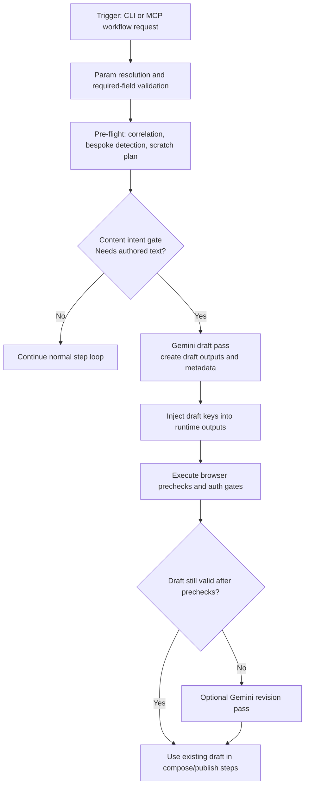

# Gemini Writer Invocation Brief

Date: 2026-04-19
Source of truth: forge-memory.db context_store
Purpose: discussion handoff for invocation flow before gemini-writer.ts is called.

## Invocation Graph

```mermaid
flowchart TD
  A[CLI workflow command or MCP run_workflow tool] --> B[Resolve workflow definition from BUILTIN_WORKFLOWS or tool payload]
  B --> C[workflowEngine.run(definition, params, sessionId)]
  C --> D[Resolve defaults and required params]
  D --> E[Build resolvedDefinition and pre-flight memory context]
  E --> F[Step loop runtime substitution using resolvedParams + outputs]
  F --> G[executeStep(step, runtimeParams)]
  G --> H{step.type == generate_content}
  H -->|no| F
  H -->|yes| I[getGeminiWriter() from gemini-writer.ts]
  I --> J[GeminiWriter.writePost(opts)]
  J --> K[outputs[outputKey] + optional outputTitleKey updated]
  K --> L[telemetry: workflow.generate_content.completed]
```

## Traversal Layers Before Invocation

### Layer 0: Entry Surface
- Sources:
  - src/cli/index.ts workflow command
  - src/mcp/server.ts run workflow tool
- Effect:
  - Select workflow and call workflowEngine.run

### Layer 1: Definition and Param Resolution
- Source:
  - src/workflow/engine.ts run()
- Effect:
  - Apply defaults and validate required params.
  - Construct resolvedDefinition.

### Layer 2: Pre-flight Correlation
- Source:
  - src/workflow/engine.ts run() pre-flight
- Effect:
  - Memory correlation.
  - Bespoke detection.
  - Scratch planning.

### Layer 3: Runtime Step Traversal
- Source:
  - src/workflow/engine.ts step loop plus executeStep
- Effect:
  - Per-step runtime substitution with resolvedParams plus outputs.
  - Switch dispatch by step type.

### Layer 4: Generate Content Branch Gate
- Source:
  - src/workflow/engine.ts executeStep case generate_content
- Condition:
  - step.type === generate_content
- Effect:
  - Only here is gemini-writer.ts invoked via getGeminiWriter().

## Module Preconditions
- GEMINI_API_KEY must be present (constructor guard).
- generate_content step fields must be available:
  - platform
  - topic
  - outputKey
  - optional context and outputTitleKey

## Runtime Effects After Invocation
- Workflow outputs updated with generated content.
- workflow.generate_content.completed telemetry event emitted.

## Quick Review Pointers
- src/cli/index.ts
- src/mcp/server.ts
- src/workflow/engine.ts
- src/content/gemini-writer.ts

## Proposed Near-Trigger Placement

Your recommendation: invoke GeminiWriter one step below pre-flight.

Mapped as a revised control plane:



Operationally this means:
- The writer runs earlier than step-local generate_content.
- Downstream steps consume stable output keys from outputs.
- Duplicate/auth/platform checks can still force revision before irreversible actions.

## Counter To Early Mandatory Invocation

Counter-position: placing GeminiWriter immediately below pre-flight for every workflow is too broad.

Why the blanket move is risky:
- Many workflows are non-authoring tasks. Early generation would spend model calls where no authored text is needed.
- Pre-flight does not yet include portal-state facts discovered later in browser checks. Early drafts can be context-poor or wrong for the final screen state.
- Early generation increases stale-content risk when duplicate checks, policy checks, or human edits later force changes.
- If auth or navigation fails, early generation becomes sunk cost and noisy telemetry.

So the stronger rule is not "always early"; it is "early only when intent and gates justify it."

## Recommended Design (Balanced)

Use a two-pass conditional writer strategy.

Pass 1 (near trigger, post pre-flight):
- Run only when workflow declares `contentIntent: required`.
- Produce initial draft and metadata (model, length, timestamp, source params hash).

Pass 2 (just before compose/publish):
- Run only if invalidation signals are present.
- Invalidation examples: duplicate-risk warning, policy mismatch, human edits requested, stale context hash.

Decision contract:
- Default: reuse Pass 1 output.
- Escalate to Pass 2 only on explicit invalidation.
- Never publish without a final draft-valid flag.

## Practical Placement Update

If implemented in engine terms:
- Keep `generate_content` step support for explicit workflows.
- Add a pre-loop "content bootstrap" hook right after pre-flight.
- Gate bootstrap by workflow metadata, not by global default.
- Emit separate telemetry:
  - `workflow.content.bootstrap.completed`
  - `workflow.content.bootstrap.skipped`
  - `workflow.content.revision.completed`

This gives you the benefit you want (writer closer to trigger) without forcing unnecessary generation on tasks that do not need authored content.

## Implemented Logic Tests (Runtime Gates)

The engine now enforces two pre-flight logic tests before social posting steps:

1. Content-intent + message-presence test:
- If workflow is social-posting and user already provided message text/title, Gemini bootstrap is skipped.
- If workflow is social-posting and message text/title is missing, stateful handoff to GeminiWriter is required.

2. Editorial approval test:
- When GeminiWriter generates the draft in pre-flight, HITL review is mandatory before posting path continues.
- The workflow pauses in HITL QA and only proceeds after approval.

Operational note:
- For generated social drafts, missing UI channel (`AI_VISION_UI_PORT`) is treated as a hard error because approval is mandatory.

## Editor-in-Chief Policy

GeminiWriter is now treated as editorial authority for missing-message social workflows:
- Pre-flight promotes GeminiWriter to first author when user message is absent.
- Posting pipeline cannot mark draft as ready until HITL approves the Gemini draft.
- Step-level `generate_content` reuses approved pre-flight draft outputs when already present.
