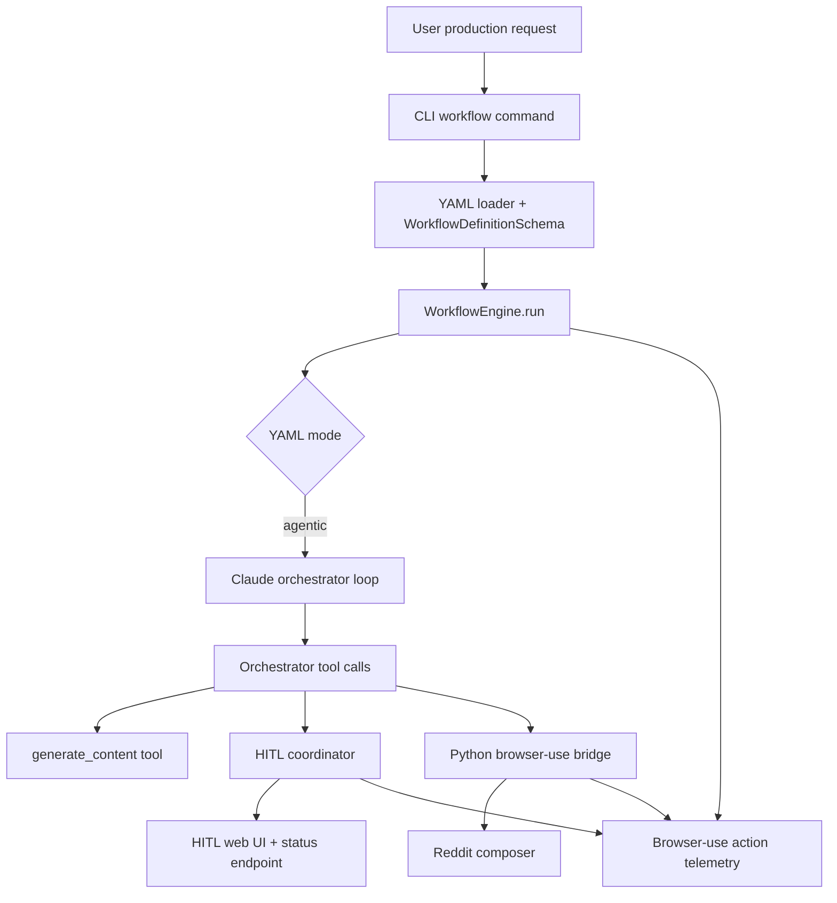

# Reddit Production Run Bug Trace

Date: 2026-04-24

## Scope

This trace covers the supervised production run request:

- post to Reddit `r/test`
- publish an update on progress made in the `ai-vision` application
- use all three application agents

The run used `workflows/write_and_post_to_reddit.yaml`, because it is the only Reddit workflow path that exercises all three application roles:

- Orchestrator agent: `src/orchestrator/loop.ts`
- Author/content generation path: `generate_content`
- Executor/browser automation agent: `browser-use`

The run was stopped before submission. No Reddit post was published.

## Production Line Shape



The important production-line split is `mode: agentic`. Direct workflows use the deterministic `src/workflow/engine.ts` step runner. The production run used the Claude orchestrator loop, so an extra LLM planning layer sits between the YAML workflow and HITL/browser execution.

## Bug 1: YAML Workflow Fails Before Runtime

### Error Shape

The checked-in YAML workflow fails validation before execution:

```text
Invalid enum value. Expected 'factual' | 'conversational' | 'professional' | 'direct', received '{{tone}}'
path: steps.0.tone
```

### Layer Count Before Bug Is Generated

3 layers:

1. CLI workflow command receives the YAML path.
2. `src/orchestrator/loader.ts` parses YAML and calls `parseWorkflowDefinition`.
3. `src/workflow/types.ts` validates `GenerateContentStepSchema.tone` as a fixed enum.

### Source Trace

- `workflows/write_and_post_to_reddit.yaml` sets `steps[0].tone: "{{tone}}"`.
- `src/workflow/types.ts` declares `GenerateContentStepSchema.tone` as `z.enum([...])`.
- Runtime param substitution happens later in the engine, so schema validation sees the literal template string and rejects it.

### Root Cause

The workflow schema validates step fields before template substitution. `tone` is typed as an enum at schema-load time, but the YAML expresses it as a runtime template.

### Boundary That Should Own The Fix

Workflow schema/loading boundary:

- either allow templated enum fields in YAML and validate after substitution
- or require YAML authors to use fixed enum values in step fields
- or introduce a typed param binding mechanism for enum-valued fields

## Bug 2: False HITL Login Requirement

### Error Shape

The app requested a Reddit login/authentication HITL handoff even though the authenticated Reddit submit page was already visible.

Telemetry showed:

```text
hitl.wait.started
reason: Reddit login is required before posting...
url: https://www.reddit.com/r/test/submit/?type=TEXT
```

### Layer Count Before Bug Is Generated

5 layers:

1. YAML workflow contains a `reddit_login` human step.
2. Workflow engine routes `mode: agentic` YAML into `runOrchestratorLoop`.
3. Claude orchestrator receives only step IDs/types plus instructions, not a deterministic auth-verification contract.
4. Orchestrator chooses `human_takeover` for login verification.
5. `hitlCoordinator.requestTakeover` emits the login HITL wait.

### Source Trace

- `workflows/write_and_post_to_reddit.yaml` has a `human_takeover` step for `reddit_login`, but no `authVerification` contract.
- `src/workflow/engine.ts` has deterministic auth-skip logic only in the direct workflow path via `isAuthVerificationSatisfied(sub)`.
- `src/workflow/engine.ts` routes agentic YAML to `runOrchestratorLoop(...)` before the direct loop executes.
- `src/orchestrator/loop.ts` implements `human_takeover` as a blind pause; it does not inspect portal authenticated state.

### Root Cause

Auth verification exists in the direct engine path but not in the agentic orchestrator path. The agentic path treats the login step as a planning/tool decision instead of a deterministic portal-state check.

### Boundary That Should Own The Fix

The orchestrator/HITL contract boundary:

- agentic workflows need an `authVerification`-aware tool or pre-tool guard
- the orchestrator should not infer login state from prompt text
- auth checks should run deterministically before emitting HITL login handoff

## Bug 3: HITL Button Hidden During Login Handoff

### Error Shape

The UI showed an `AWAITING HUMAN` phase and screenshot stream, but no visible confirm/return-control button. The only visible left panel was the HITL QA note box.

At one point `/api/status` returned:

```json
{"phase":"idle"}
```

while the visible browser was already on Reddit.

Later status returned running or awaiting state depending on timing.

### Layer Count Before Bug Is Generated

6 layers:

1. Orchestrator tool emits `onStateUpdate({ phase: 'awaiting_human', hitlReason, hitlInstructions })`.
2. `hitlCoordinator.requestTakeover` emits `takeover_requested`.
3. UI server listens for `takeover_requested`.
4. UI server builds broadcast state from `workflowEngine.currentState ?? fallback`.
5. Browser client renders HITL box only if phase is `awaiting_human` or `hitl_qa` and `state.hitlReason` exists.
6. Screenshot/status paths can diverge from HITL event paths, so the page can show a phase/screenshot without the HITL action state required to render the button.

### Source Trace

- `src/ui/server.ts` renders the handoff box only when `(phase === 'awaiting_human' || phase === 'hitl_qa') && state.hitlReason`.
- `src/ui/server.ts` status endpoint returns `workflowEngine.currentState ?? { phase: 'idle' }`.
- `src/ui/server.ts` screenshot push fallback can independently synthesize an `awaiting_human` state if no workflow state exists.
- `src/session/hitl.ts` stores `_reason` and `_instructions`, but the UI status endpoint does not read them from `hitlCoordinator`; it reads workflow state.

### Root Cause

There are two state owners: `workflowEngine.currentState` and `hitlCoordinator`. The UI depends on workflow state for button rendering, but HITL events and screenshot pushing can show partial HITL status without the complete action payload.

### Boundary That Should Own The Fix

UI/HITL state ownership boundary:

- expose one canonical HITL session state to `/api/status`
- include `hitlAction`, `hitlReason`, and `hitlInstructions` from `hitlCoordinator` when workflow state is missing or stale
- avoid separate fallback states for screenshot push versus status/render state

## Bug 4: Draft Review Handoff Never Appears After Composer Fill

### Error Shape

The browser-use executor successfully filled the Reddit draft and emitted `orchestrator.tool.success` for `draft_reddit_post`.

Telemetry then emitted:

```text
hitl.qa_pause.started
reason: Approval required before: human_takeover (step: submit_reddit_post)
```

But `/api/status` stayed:

```json
{
  "phase": "running",
  "currentStep": "browser-use: done",
  "currentUrl": "https://www.reddit.com/r/test/submit/?type=TEXT"
}
```

The UI therefore showed `RUNNING` and no HITL approval button.

### Layer Count Before Bug Is Generated

6 layers:

1. YAML `permissions.require_human_approval_before` includes `submit_reddit_post`.
2. Claude orchestrator plans a `human_takeover` tool call for `submit_reddit_post`.
3. Permission gate in `src/orchestrator/loop.ts` detects the approval requirement.
4. Permission gate calls `hitlCoordinator.requestQaPause(...)`.
5. Permission gate does not call `onStateUpdate(...)` before waiting.
6. UI status endpoint returns stale `workflowEngine.currentState`, which remains `running`.

### Source Trace

- `src/orchestrator/loop.ts` permission gate calls `requestQaPause` before executing the tool.
- That same block does not update `workflowEngine.currentState` with `phase: 'hitl_qa'`, `hitlAction: 'approve_draft'`, `hitlReason`, or `hitlInstructions`.
- `src/ui/server.ts` renders HITL controls from `workflowEngine.currentState`, not directly from `hitlCoordinator`.
- The orchestrator `human_takeover` tool itself would call `onStateUpdate`, but the permission gate blocks before that tool executes.

### Root Cause

The permission-gate HITL pause is missing the state update that the normal `human_takeover` path performs. It emits telemetry and blocks the orchestrator, but it does not publish a UI-renderable workflow state.

### Boundary That Should Own The Fix

Orchestrator permission-gate boundary:

- before `requestQaPause`, call `onStateUpdate({ phase: 'hitl_qa', hitlAction: 'approve_draft', hitlReason, hitlInstructions })`
- after return, clear HITL state back to `running`
- ideally use a shared helper so direct engine and orchestrator permission pauses cannot diverge

## Bug 5: Author Generated Generic AI Vision Content Instead Of App Progress

### Error Shape

The draft filled in Reddit was about generic AI vision industry progress:

```text
Real Progress in AI Vision: What's Actually Working in 2025
```

The requested topic was progress made on the `ai-vision` application.

### Layer Count Before Bug Is Generated

5 layers:

1. User passes detailed `topic` and `context` params into CLI.
2. YAML workflow defines `generate_content` as the first step.
3. Agentic orchestrator receives a compact step list plus params, not full resolved per-step instructions.
4. Orchestrator tool implementation for `generate_content` is a placeholder, not the real Gemini writer.
5. Claude orchestrator later writes its own `agent_task` prompt to browser-use, using generated/generic content from its conversation rather than a deterministic workflow output.

### Source Trace

- `src/orchestrator/loop.ts` `generate_content` tool returns placeholder strings:
  - body: `[Generated reddit content for: ...]`
  - title: `[Title: ...]`
- `src/workflow/engine.ts` direct path has a real `generate_content` implementation with `getGeminiWriter().writePost(...)`.
- `src/workflow/engine.ts` direct path also has preflight content bootstrap for social workflows.
- The agentic path returns before direct preflight/content bootstrap starts, because agentic YAML is routed to `runOrchestratorLoop(...)`.

### Root Cause

There are two authoring implementations:

- direct workflow path: real writer + output propagation
- agentic orchestrator path: placeholder tool output + LLM-generated downstream prompt

The production run used the weaker agentic authoring path.

### Boundary That Should Own The Fix

Author/orchestrator tool boundary:

- make the orchestrator `generate_content` tool call the same content writer used by the direct workflow engine
- persist `output_key` and `output_title_key` from the real writer
- require downstream `agent_task` prompts to consume those outputs, not re-author content
- fail fast if generated title/body are placeholders or empty

## Bug 6: Manual Correction Hit Browser-Use Action Validation Error

### Error Shape

Manual correction through `/task` triggered browser-use model output validation errors:

```text
46 validation errors for AgentOutput
action.1.DoneActionModel.done Field required
action.1.DoneActionModel.key_combination Extra inputs are not permitted
...
action.1.SendKeysActionModel.send_keys Field required
action.1.SendKeysActionModel.key_combination Extra inputs are not permitted
```

Browser-use expected an action model such as `send_keys`, but the LLM emitted a raw `key_combination: Control+a` object at `action.1`.

### Layer Count Before Bug Is Generated

4 layers:

1. Local correction request is sent to browser-use bridge `/task`.
2. `src/engines/browser-use/server/main.py` creates a browser-use `Agent`.
3. The provider LLM emits an invalid action object.
4. browser-use Pydantic model validation rejects the action list.

### Source Trace

- `src/engines/browser-use/server/main.py` passes the prompt to browser-use `Agent(...)`.
- `run_task` only retries provider failover for provider-like failures, CDP session failures, or stale session failures.
- The observed validation failure is an action-schema failure, not a provider-failover failure.

### Root Cause

The browser-use model action schema is brittle for keyboard shortcut operations. The prompt induced a raw `key_combination` action that is not valid in the installed browser-use `0.12.2` action union.

### Boundary That Should Own The Fix

Browser-use bridge/tooling boundary:

- avoid correction prompts that require keyboard shortcuts
- add deterministic Playwright helper endpoints for clearing and replacing title/body
- classify browser-use action schema validation as a recoverable automation failure with a deterministic fallback
- consider upgrading browser-use only after regression testing the Reddit workflow

## Cross-Cutting Layer Count

The full production line before the user-visible failure involved 10 layers:

1. User request and CLI params
2. YAML workflow file
3. YAML loader and Zod workflow schema
4. Workflow engine runtime mode router
5. Claude orchestrator planning loop
6. Orchestrator tool shim layer
7. HITL coordinator
8. UI server status/WebSocket/screenshot layer
9. Python browser-use bridge
10. Reddit web UI

The first bug was generated at layer 3. The false login HITL was generated at layer 5. The missing draft approval handoff was generated at layer 6 and surfaced at layer 8. The wrong content was generated across layers 5-6 and executed at layer 9. The browser-use correction error was generated at layer 10's automation tool model boundary inside layer 9.

## Key Architectural Finding

The production line has split semantics between direct and agentic workflows:

- Direct path has stronger deterministic runtime behavior: real content writer, auth verification, explicit HITL state updates, output substitution traces.
- Agentic path has weaker shims: placeholder content generation, LLM-planned login decisions, permission-gate pauses without state publication, and browser-use prompt dependence.

For production social publishing, the agentic path currently introduces more layers than it stabilizes. The safer near-term direction is to either harden the agentic tool shims to reuse direct-engine primitives or run Reddit posting through the direct workflow path after fixing its deterministic fields.

## Acceptance Criteria For A Follow-Up Fix

- `write_and_post_to_reddit.yaml` loads without a temporary file.
- Authenticated Reddit submit page skips login HITL deterministically.
- Every HITL wait has a visible UI action button and a matching `/api/status` phase.
- Draft approval gate appears after composer fill and before submission.
- Author output is about `ai-vision` application progress, not generic AI vision industry content.
- Browser-use action validation errors are either avoided by deterministic helpers or surfaced as a structured workflow failure.
- A regression test covers agentic permission-gate state publication.
