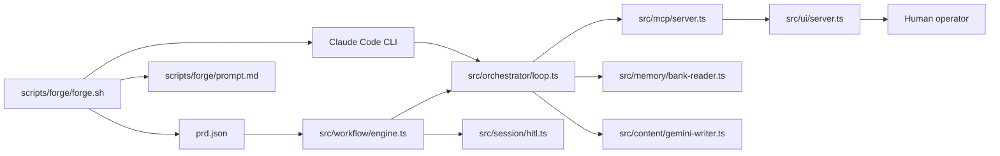

# Claude Layer / Shape / Connects

Source scan: `rg -n "Claude" .`

## Result

- No exact typo was present in the repository.
- The repository consistently uses `Claude`, so this artifact records the Claude-related layers, shape, and connections instead.

## Layers

### 1. Entry / Build Loop

- `scripts/forge/forge.sh`
- `scripts/forge/prompt.md`
- `prd.json`
- `.claude/*`

Role:

- Boots the Forge loop.
- Builds the agent prompt/context.
- Pulls the next story from `prd.json`.
- Invokes the Claude Code CLI for iteration runs.

### 2. Workflow Orchestration

- `src/workflow/engine.ts`
- `src/orchestrator/loop.ts`

Role:

- Routes YAML workflows into the Claude orchestrator loop when `mode: agentic`.
- Runs step substitution, session state updates, telemetry, and browser execution.
- Defines the Claude tool surface and maps tool calls to runtime actions.

### 3. Tool Exposure / API Surface

- `src/mcp/server.ts`
- `src/cli/index.ts`

Role:

- Exposes browser and workflow capabilities as Claude-native MCP tools.
- Provides the local CLI entrypoint used to start the MCP server and HITL UI.

### 4. Human-in-the-Loop Layer

- `src/ui/server.ts`
- `src/session/hitl.ts`
- `src/workflow/engine.ts`

Role:

- Hands control back to the operator for sensitive or final-step actions.
- Shows the HITL UI text and state transitions that mention Claude explicitly.

### 5. Memory / Context Layer

- `src/memory/bank-reader.ts`
- `scripts/forge/forge-memory-client.ts`
- `src/content/gemini-writer.ts`

Role:

- Feeds context into Claude sessions.
- Preserves Forge memory and context handling for iterative runs.
- Separates Claude reasoning from content-generation responsibilities.

### 6. Documentation / Planning Layer

- `docs/artifacts/AI_VISION_V2_BLUEPRINT.md`
- `docs/artifacts/CTO Technical Report.md`
- `Application_Test.md`
- `Application_Fixes.md`
- `workflows/*.yaml`

Role:

- Captures the higher-level architecture and workflow intent.
- Records prior story implementation history and operational guidance.

## Shape

The Claude surface is a hub-and-spoke architecture:

- The Forge loop is the outer execution shell.
- The workflow engine is the routing hub.
- The orchestrator loop is the reasoning hub for agentic YAML workflows.
- MCP and HITL are the two primary interaction spokes.
- Memory and docs provide the context spine that feeds the whole system.

## Connects

- `scripts/forge/forge.sh` connects Forge memory, PRD selection, and Claude CLI execution.
- `src/workflow/engine.ts` connects workflow definition handling to the orchestrator loop when YAML is agentic.
- `src/orchestrator/loop.ts` connects Claude tool calls to runtime browser/session actions and telemetry updates.
- `src/mcp/server.ts` connects external MCP clients to browser automation, workflow execution, telemetry, and memory access.
- `src/ui/server.ts` and `src/session/hitl.ts` connect the browser-run state to operator takeover and final confirmation.
- `src/memory/bank-reader.ts` connects stored context into Claude prompts so the orchestrator can reuse session knowledge.

## Notes

- The repo’s naming is `Claude` consistently.
- The strongest architectural connection is between `src/workflow/engine.ts` and `src/orchestrator/loop.ts`: direct workflows stay deterministic, while `mode: agentic` routes to Claude reasoning.
- The runtime UI is not separate from execution; HITL and workflow state share the same process boundary.
