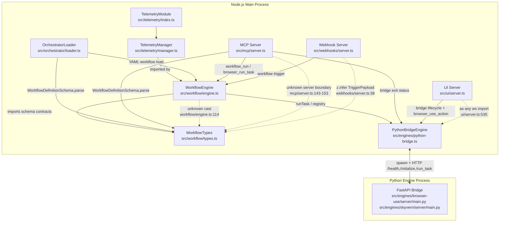

# Audit: Telemetry Blind Spots And TSC Heap Exhaustion

## Scope

- Entry point: [src/telemetry/index.ts](/home/spoq/ai-vision/src/telemetry/index.ts)
- Runtime detector: [src/telemetry/manager.ts#L49](/home/spoq/ai-vision/src/telemetry/manager.ts#L49), [src/telemetry/manager.ts#L68](/home/spoq/ai-vision/src/telemetry/manager.ts#L68), [src/telemetry/manager.ts#L120](/home/spoq/ai-vision/src/telemetry/manager.ts#L120)
- Startup anchors: [src/workflow/engine.ts](/home/spoq/ai-vision/src/workflow/engine.ts), [src/orchestrator/loader.ts](/home/spoq/ai-vision/src/orchestrator/loader.ts), [src/mcp/server.ts](/home/spoq/ai-vision/src/mcp/server.ts), [src/engines/python-bridge.ts](/home/spoq/ai-vision/src/engines/python-bridge.ts)

## Startup And FFI Graph

## Layer Connectivity

### Telemetry To Workflow To Loader To MCP

- [src/telemetry/index.ts#L1](/home/spoq/ai-vision/src/telemetry/index.ts#L1) re-exports `telemetry` and `TelemetryManager` from [src/telemetry/manager.ts](/home/spoq/ai-vision/src/telemetry/manager.ts).
- [src/workflow/engine.ts#L53](/home/spoq/ai-vision/src/workflow/engine.ts#L53) imports `telemetry` from [src/telemetry](/home/spoq/ai-vision/src/telemetry/index.ts).
- [src/orchestrator/loader.ts#L11](/home/spoq/ai-vision/src/orchestrator/loader.ts#L11) imports `WorkflowDefinitionSchema` from [src/workflow/types.ts](/home/spoq/ai-vision/src/workflow/types.ts).
- [src/orchestrator/loader.ts#L18](/home/spoq/ai-vision/src/orchestrator/loader.ts#L18) and [src/orchestrator/loader.ts#L21](/home/spoq/ai-vision/src/orchestrator/loader.ts#L21) parse YAML through `WorkflowDefinitionSchema.parse(...)`.
- [src/mcp/server.ts#L37](/home/spoq/ai-vision/src/mcp/server.ts#L37) imports `workflowEngine` from [src/workflow/engine.ts](/home/spoq/ai-vision/src/workflow/engine.ts).
- [src/mcp/server.ts#L38](/home/spoq/ai-vision/src/mcp/server.ts#L38) imports `BUILTIN_WORKFLOWS` and `WorkflowDefinitionSchema` from [src/workflow/types.ts](/home/spoq/ai-vision/src/workflow/types.ts).
- [src/mcp/server.ts#L42](/home/spoq/ai-vision/src/mcp/server.ts#L42) imports runtime telemetry from [src/telemetry/manager.ts](/home/spoq/ai-vision/src/telemetry/manager.ts).

### MCP Dependency Map

- CLI startup loads MCP at [src/cli/index.ts#L211](/home/spoq/ai-vision/src/cli/index.ts#L211) and starts it at [src/cli/index.ts#L212](/home/spoq/ai-vision/src/cli/index.ts#L212).
- MCP imports `sessionManager` at [src/mcp/server.ts#L34](/home/spoq/ai-vision/src/mcp/server.ts#L34), `hitlCoordinator` at [src/mcp/server.ts#L35](/home/spoq/ai-vision/src/mcp/server.ts#L35), `workflowEngine` at [src/mcp/server.ts#L36](/home/spoq/ai-vision/src/mcp/server.ts#L36), workflow schemas at [src/mcp/server.ts#L37](/home/spoq/ai-vision/src/mcp/server.ts#L37), `registry` at [src/mcp/server.ts#L38](/home/spoq/ai-vision/src/mcp/server.ts#L38), bridge status at [src/mcp/server.ts#L39](/home/spoq/ai-vision/src/mcp/server.ts#L39), Gemini writer at [src/mcp/server.ts#L40](/home/spoq/ai-vision/src/mcp/server.ts#L40), telemetry at [src/mcp/server.ts#L41](/home/spoq/ai-vision/src/mcp/server.ts#L41), and long-term memory at [src/mcp/server.ts#L42](/home/spoq/ai-vision/src/mcp/server.ts#L42).
- `workflow_run` normalizes tool input at [src/mcp/server.ts#L338](/home/spoq/ai-vision/src/mcp/server.ts#L338), parses inline workflow JSON through `WorkflowDefinitionSchema.parse(...)` at [src/mcp/server.ts#L343](/home/spoq/ai-vision/src/mcp/server.ts#L343), and invokes `workflowEngine.run(...)` at [src/mcp/server.ts#L359](/home/spoq/ai-vision/src/mcp/server.ts#L359).
- `query_telemetry` reads telemetry through `telemetry.recentAlerts(...)` or `telemetry.recent(...)` at [src/mcp/server.ts#L470](/home/spoq/ai-vision/src/mcp/server.ts#L470) to [src/mcp/server.ts#L473](/home/spoq/ai-vision/src/mcp/server.ts#L473).
- `session_status` reads bridge exit state through `getLatestBridgeExitEvent()` at [src/mcp/server.ts#L386](/home/spoq/ai-vision/src/mcp/server.ts#L386).

### Webhook Dependency Map

- CLI startup loads the webhook server at [src/cli/index.ts#L208](/home/spoq/ai-vision/src/cli/index.ts#L208) and starts it at [src/cli/index.ts#L209](/home/spoq/ai-vision/src/cli/index.ts#L209).
- Webhook imports `workflowEngine` at [src/webhooks/server.ts#L23](/home/spoq/ai-vision/src/webhooks/server.ts#L23), `BUILTIN_WORKFLOWS` at [src/webhooks/server.ts#L24](/home/spoq/ai-vision/src/webhooks/server.ts#L24), and `telemetry` at [src/webhooks/server.ts#L25](/home/spoq/ai-vision/src/webhooks/server.ts#L25).
- Request payload validation is defined at [src/webhooks/server.ts#L32](/home/spoq/ai-vision/src/webhooks/server.ts#L32) and inferred into `TriggerPayload` at [src/webhooks/server.ts#L38](/home/spoq/ai-vision/src/webhooks/server.ts#L38).
- Server bind begins at [src/webhooks/server.ts#L96](/home/spoq/ai-vision/src/webhooks/server.ts#L96).
- Workflow execution begins only after a validated payload at [src/webhooks/server.ts#L136](/home/spoq/ai-vision/src/webhooks/server.ts#L136).
- Runtime telemetry starts after workflow execution via `webhook.trigger.completed` at [src/webhooks/server.ts#L144](/home/spoq/ai-vision/src/webhooks/server.ts#L144), callback failure telemetry at [src/webhooks/server.ts#L162](/home/spoq/ai-vision/src/webhooks/server.ts#L162), and trigger failure telemetry at [src/webhooks/server.ts#L173](/home/spoq/ai-vision/src/webhooks/server.ts#L173).

## Gap Analysis

| Gap | Visibility | Why telemetry did not flag it | References |
| --- | --- | --- | --- |
| Workflow step substitution cast | Compile-time only | `TelemetryManager.emit(...)` only runs after a live event is emitted; the `result as unknown as WorkflowStep` cast participates in checker work before runtime execution begins. | [src/workflow/engine.ts#L114](/home/spoq/ai-vision/src/workflow/engine.ts#L114), [src/telemetry/manager.ts#L120](/home/spoq/ai-vision/src/telemetry/manager.ts#L120) |
| Workflow schema expansion seam | Compile-time only | `WorkflowDefinitionSchema` and `WorkflowStepSchema` are checked when loader and MCP parse definitions; no runtime telemetry hook exists in schema construction or TypeScript graph expansion. | [src/workflow/types.ts#L381](/home/spoq/ai-vision/src/workflow/types.ts#L381), [src/workflow/types.ts#L396](/home/spoq/ai-vision/src/workflow/types.ts#L396), [src/orchestrator/loader.ts#L21](/home/spoq/ai-vision/src/orchestrator/loader.ts#L21), [src/mcp/server.ts#L343](/home/spoq/ai-vision/src/mcp/server.ts#L343), [src/telemetry/manager.ts#L68](/home/spoq/ai-vision/src/telemetry/manager.ts#L68) |
| MCP unknown server boundary | Compile-time only | The `server as { tool: ... }` boundary hides SDK generic shape inside a cast; no runtime telemetry event is emitted while TypeScript expands or validates that seam. | [src/mcp/server.ts#L143](/home/spoq/ai-vision/src/mcp/server.ts#L143), [src/mcp/server.ts#L144](/home/spoq/ai-vision/src/mcp/server.ts#L144), [src/mcp/server.ts#L153](/home/spoq/ai-vision/src/mcp/server.ts#L153), [src/telemetry/manager.ts#L120](/home/spoq/ai-vision/src/telemetry/manager.ts#L120) |
| Webhook payload inference seam | Compile-time for the inferred type; runtime only after request acceptance | `TriggerPayload` is inferred from Zod at compile time, while webhook telemetry is emitted only after request parse, workflow execution, or callback failure. | [src/webhooks/server.ts#L32](/home/spoq/ai-vision/src/webhooks/server.ts#L32), [src/webhooks/server.ts#L38](/home/spoq/ai-vision/src/webhooks/server.ts#L38), [src/webhooks/server.ts#L119](/home/spoq/ai-vision/src/webhooks/server.ts#L119), [src/webhooks/server.ts#L144](/home/spoq/ai-vision/src/webhooks/server.ts#L144) |
| UI websocket `as any` import | Runtime boundary | The cast is executed before the first UI telemetry event; if the issue is compiler heap growth, runtime telemetry never observes it because the telemetry path begins after import resolution and server construction. | [src/ui/server.ts#L535](/home/spoq/ai-vision/src/ui/server.ts#L535), [src/ui/server.ts#L541](/home/spoq/ai-vision/src/ui/server.ts#L541), [src/telemetry/manager.ts#L120](/home/spoq/ai-vision/src/telemetry/manager.ts#L120) |
| Telemetry detector scope | Runtime only | The detector only classifies emitted runtime events such as `workflow.step.failed`, `session.browser.exited`, `ui.screenshot.failed`, and `ui.state.sync.missing`; it has no build-time observer for `tsc` heap expansion. | [src/telemetry/manager.ts#L68](/home/spoq/ai-vision/src/telemetry/manager.ts#L68), [src/telemetry/manager.ts#L77](/home/spoq/ai-vision/src/telemetry/manager.ts#L77), [src/telemetry/manager.ts#L85](/home/spoq/ai-vision/src/telemetry/manager.ts#L85), [src/telemetry/manager.ts#L101](/home/spoq/ai-vision/src/telemetry/manager.ts#L101), [src/telemetry/manager.ts#L109](/home/spoq/ai-vision/src/telemetry/manager.ts#L109), [src/telemetry/manager.ts#L120](/home/spoq/ai-vision/src/telemetry/manager.ts#L120) |

## Hygiene Scan Notes

- No `@deprecated` annotations were found in the audited startup files under `src/workflow`, `src/mcp`, `src/engines`, `src/ui`, or `src/webhooks`.
- No comments marked `stub` were found in the audited startup files.
- The audited cast seams that remain on the startup path are [src/workflow/engine.ts#L114](/home/spoq/ai-vision/src/workflow/engine.ts#L114), [src/mcp/server.ts#L143](/home/spoq/ai-vision/src/mcp/server.ts#L143) to [src/mcp/server.ts#L153](/home/spoq/ai-vision/src/mcp/server.ts#L153), and [src/ui/server.ts#L535](/home/spoq/ai-vision/src/ui/server.ts#L535).
