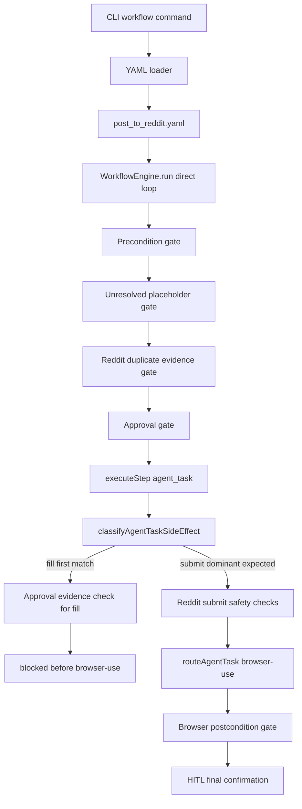

# US-031/US-032 Live Prompt Classifier Drift Investigation

Date: `2026-04-28`

Status:
- Original dominant-submit drift: resolved by US-032 / RF-014
- Second duplicate-check prompt drift: open
- Current next story: US-033 / RF-015
- Production Reddit run: NO-GO until US-033 is implemented

Seed trigger:

```text
Agent reports US-031 as implemented. Use this information as the seed content
for the next full production run of the ai-vision application posting to r/test
on reddit.
```

## A. Executive Summary

This report now tracks a live drift chain in the direct Reddit workflow rather than a single isolated issue.

First drift:

- `submit_reddit_post` mixed fallback fill wording with dominant submit wording.
- The original US-031 classifier was deterministic but first-match based, so the live prompt could resolve to `fill` instead of dominant `submit`.
- That drift was resolved by US-032 / RF-014.

Second drift:

- `check_duplicate_reddit_post` is an evidence-producing, read-only step.
- Its live prompt mentions future posting behavior (`before posting to Reddit`) and includes `/submit` URL text.
- That means it can be misclassified as protected submit intent even though its job is to create duplicate-check evidence rather than perform submission.
- The result is a circular block: the duplicate-check step can be forced to provide duplicate evidence before it is allowed to run and create that evidence.

The root cause across both drifts is the same larger prompt-contract problem: live workflow prompts have become safety-policy inputs, but exact live prompt shapes are not yet governed as classifier contract tests.

## B. Drift Source

Primary source file:

- `workflows/post_to_reddit.yaml`

Relevant lines:

- `source: yaml`, `mode: direct`: lines 6-7
- approvals configured for `reddit_login` and `review_reddit_draft`: lines 9-12
- `submit_reddit_post` is an `agent_task`: lines 106-110
- fallback fill instruction: lines 116-119
- primary submit instruction: lines 121-125

The direct workflow intentionally uses `agent_task` for final submit, then `human_takeover` in `confirm_completion` mode for final visible verification.

This means `submit_reddit_post` crosses the US-031 safety boundary before browser-use dispatch.

## C. Execution Path

CLI production path:

1. `src/cli/index.ts` accepts `workflow [workflow-id]`.
2. YAML workflows are loaded through `loadYamlWorkflow(...)`.
3. CLI starts the HITL UI with `startUiServer(uiPort)`.
4. CLI calls `workflowEngine.run(definition, params, sessionId)`.
5. The direct engine runs because `post_to_reddit.yaml` is `mode: direct`.

Key line references:

- workflow command: `src/cli/index.ts` lines 219-226
- YAML file loading: `src/cli/index.ts` lines 274-282
- UI server start: `src/cli/index.ts` lines 314-316
- engine run call: `src/cli/index.ts` line 328

Direct engine path:

1. Params/defaults are resolved.
2. Steps are substituted with runtime params.
3. Direct workflow bypasses `mode: agentic`.
4. Short-term memory and telemetry begin.
5. Run loop re-substitutes each step against live outputs.
6. Precondition gate runs.
7. unresolved-placeholder gate runs.
8. Reddit duplicate evidence gate runs for `submit_reddit_post`.
9. Approval gate runs when workflow permissions select the step.
10. `executeStep(...)` dispatches the `agent_task`.
11. US-031 classifies prompt side-effect intent before worker dispatch.
12. Browser-use executes only if the safety gate allows dispatch.
13. Browser postcondition gate validates after execution.
14. HITL final confirmation verifies visible Reddit result.

Key line references:

- agentic branch bypass for direct workflows: `src/workflow/engine.ts` lines 2172-2178
- direct loop starts: `src/workflow/engine.ts` lines 2285-2291
- precondition gate: `src/workflow/engine.ts` lines 2332-2348
- unresolved-placeholder gate: `src/workflow/engine.ts` lines 2423-2479
- Reddit duplicate gate: `src/workflow/engine.ts` lines 2481-2558
- approval gate: `src/workflow/engine.ts` lines 2560-2670
- `executeStep(...)` call: `src/workflow/engine.ts` lines 2672-2679
- browser postcondition gate: `src/workflow/engine.ts` lines 2684-2731

## D. Shape Map

### YAML Layer

Shape: declaration boundary

Responsibilities:

- declares direct workflow mode
- declares step sequence
- declares permission selectors
- embeds prompt text that becomes classifier input

Risk:

- prompt wording now participates in deterministic safety classification
- old prompt patterns can become runtime policy inputs after gate stories land

### CLI/UI Layer

Shape: trigger plus HITL UI host

Responsibilities:

- loads YAML
- starts UI
- starts workflow run
- persists run result

Risk:

- production run will exercise actual workflow prompt text, not only unit-test fixtures

### Direct Engine Run Loop

Shape: state machine plus gate pipeline

Responsibilities:

- resolves runtime params and outputs
- runs precondition, duplicate, approval, execution, postcondition gates
- publishes state and telemetry

Risk:

- gate order is correct, but classifier semantics inside `executeStep` can re-interpret a step after earlier gates already passed

### `agent_task` Dispatch Layer

Shape: dispatcher plus safety boundary

Responsibilities:

- prepares prompt
- checks unresolved placeholders
- classifies prompt intent
- blocks or permits worker dispatch
- routes to selected engine

Risk:

- current classifier returns on first matching protected intent
- no dominant-intent resolution exists
- fallback instructions can override the true step purpose

### Python/browser-use Layer

Shape: bounded browser worker

Responsibilities:

- executes browser prompt after TypeScript permits dispatch

Risk:

- not the root cause here; the drift happens before Python/browser-use dispatch

### HITL Layer

Shape: blocking wait plus operator approval plane

Responsibilities:

- approves selected protected steps
- reviews draft
- confirms final visible result

Risk:

- if classifier demands approval evidence for a step that permissions did not select, the run fails before HITL can evaluate the actual submit path

### Telemetry Layer

Shape: event sink and trace surface

Responsibilities:

- emits `workflow.agent_task_side_effect.evaluated`
- emits allowed or blocked decision

Risk:

- telemetry records the mistaken classification, but current tests do not assert the expected `intentKind` for live prompts

## E. Connection Graph



## F. Exact Failure Mechanism

Classifier source:

- `classifyAgentTaskSideEffect(...)` starts at `src/workflow/engine.ts` line 432.
- `fill` classification is evaluated at lines 463-474.
- `submit` classification is evaluated later at lines 476-483.

Live prompt source:

- fallback fill appears in `workflows/post_to_reddit.yaml` lines 116-119.
- submit appears in `workflows/post_to_reddit.yaml` lines 121-125.

Safety enforcement:

- US-031 evaluates classification in `executeStep` at `src/workflow/engine.ts` lines 1371-1395.
- `login` and `fill` require `approvalGrantedForStep === true` at lines 1401-1404.
- if missing, the step returns failure before worker dispatch at lines 1405-1416.

Therefore:

```text
submit_reddit_post prompt
  -> contains "fill them"
  -> classifier returns intentKind = fill
  -> fill requires approvalGrantedForStep === true
  -> workflow permissions do not select submit_reddit_post in post_to_reddit.yaml
  -> likely fail before browser-use dispatch
```

## G. Blast Radius

### High-confidence affected path

- `workflows/post_to_reddit.yaml`
- step `submit_reddit_post`
- direct mode
- external Reddit post production run

### Adjacent Reddit paths

`workflows/write_and_post_to_reddit.yaml` has a different runtime shape:

- `mode: agentic`
- `submit_reddit_post` is `human_takeover`, not `agent_task`
- approval selectors include `submit_reddit_post`

This path is not the same immediate failure path, but it remains architecturally relevant because `mode: agentic` splits execution semantics.

### Built-in workflow blast radius

`src/workflow/types.ts` contains built-in social workflows with similar prompt structures:

- X/Twitter publish prompts include publish/post language.
- Reddit built-in submit prompt also includes fallback fill wording before final submit language.
- DOT and dispute workflows include many form-fill and final-click instructions.

Risk pattern:

```text
Any agent_task prompt that mixes:
  high-level protected goal
  plus fallback lower-level action
can be misclassified by first-match priority.
```

Additional drift class:

```text
Evidence-producing read-only prompts that mention future protected actions
can be misclassified as protected submit/post intent and blocked by the very
evidence gate they are meant to satisfy.
```

Examples:

- submit prompt with fallback fill
- publish prompt with draft correction text
- login verification prompt with read-only check text
- form phase prompt with fill plus stop-before-submit language
- upload prompt with click-next plus do-not-submit language

### Low or no immediate blast radius

- deterministic `fill` step type is not directly affected
- deterministic `click`, `type`, `navigate` steps are not classified by this helper
- Python/browser-use internals are not the root cause
- HITL endpoints are not the root cause

## H. Test Coverage Gap

US-031 tests verify individual simplified intent shapes:

- login blocked without approval: `src/workflow/engine.test.ts` lines 2048-2076
- login allowed after approval: lines 2078-2108
- posting-style content block: lines 2110-2164
- Reddit submit-style duplicate-evidence block: lines 2166-2194
- duplicate-risk block: lines 2196-2221
- read-only allowed: lines 2223-2249
- postcondition still runs after protected task: lines 2251-2290

The missing test:

```text
Use the exact live workflows/post_to_reddit.yaml submit_reddit_post prompt.
Assert classification/effective gate behavior treats it as dominant submit intent.
```

The existing submit-style test uses a simplified prompt:

```text
Submit this post to the reddit subreddit by clicking the submit button
```

That fixture does not include the live prompt's fallback fill wording.

## I. Why Existing Green Tests Did Not Catch It

The test suite proves that:

- `fill` can be protected
- `submit` can be protected
- Reddit submit can require duplicate evidence
- browser postcondition can still run

It does not prove that:

- mixed-intent prompts resolve to the intended dominant action
- live workflow prompts are part of gate regression coverage
- classifier output is correct for actual production YAML

The tests asserted safety-gate presence, not semantic alignment between production prompt shape and classifier decision.

## J. State And Telemetry Impact

Expected telemetry during the drift:

- `workflow.agent_task_side_effect.evaluated`
  - `intentKind: fill`
  - `protectedIntent: true`
- `workflow.agent_task_side_effect.blocked`
  - `check: approval`
  - reason says fill intent requires prior approval evidence

Expected state:

- workflow moves to `error`
- browser-use dispatch does not happen
- Reddit post is not submitted
- final HITL confirmation is never reached

This is safer than accidental posting, but it blocks the intended production path for the wrong reason.

## K. Root Cause

Primary root cause:

- US-031 defined protected categories but not dominant-intent resolution.

Contributing causes:

- first-match classifier ordering favors low-level fill over high-level submit
- tests used simplified prompts instead of live YAML prompt fixtures
- production-run pre-flight initially moved toward a workflow workaround instead of treating drift as a blocker
- workflow prompt text became policy input without a prompt-contract compatibility pass

## L. Recommended Forge Story Seeds

### Historical Story Seed: US-032 / RF-014

Status: Completed

Goal:

- classify dominant step intent instead of first matching verb

Required behavior:

- live `submit_reddit_post` prompt classifies as submit
- fallback fill text inside submit prompt does not override submit
- standalone fill prompts still classify as fill
- login prompts still classify as login
- read-only prompts still classify as read-only
- classifier telemetry includes matched signals and selected dominant intent

Required tests:

- exact live `workflows/post_to_reddit.yaml` `submit_reddit_post` prompt
- submit plus fallback fill
- standalone fill
- publish plus draft correction
- login plus read-only verification
- read-only duplicate check

### Current Story Seed: US-033 / RF-015 — Live Workflow Prompt Contract Regression Suite

Goal:

- make live YAML prompts part of gate regression coverage
- exact live workflow prompts become classifier contract tests
- evidence-producing read-only steps are protected from circular duplicate-evidence blocking

Required behavior:

- load actual YAML workflows in tests
- extract `agent_task` prompts
- assert expected classifier intent
- assert expected gate behavior for production-critical steps

Required tests:

- `post_to_reddit.yaml` direct duplicate-check path
- `post_to_reddit.yaml` direct submit path
- `post_to_x.yaml` publish/fill separation
- `authenticated_task.yaml` user-supplied prompt policy classification
- built-in Reddit and X workflows in `src/workflow/types.ts`

### Future Story Seed: US-034 / RF-016 — agent_task Safety Policy Metadata

Goal:

- stop relying solely on prompt text for protected intent

Possible metadata:

```yaml
sideEffectPolicy:
  intent: submit
  protected: true
  requires:
    - approval
    - duplicateEvidence
    - postcondition
```

Required behavior:

- metadata overrides prompt classifier when present
- classifier remains fallback for legacy prompts
- telemetry records `source: metadata` or `source: classifier`

## M. Immediate Recommendation

Do not run a clean Reddit production test yet.

Next action:

1. Build US-033 next.
2. Include the exact live `check_duplicate_reddit_post` and `submit_reddit_post` prompts as regression fixtures.
3. Confirm evidence-producing duplicate-check prompts classify as `read_only`.
4. Confirm `post_to_reddit.yaml` can run unchanged.
5. Then run the supervised `r/test` production workflow.

## N. GO / NO-GO

| Decision | Recommendation | Reason |
|---|---|---|
| Run full production Reddit test now | NO-GO | Known classifier drift can block submit for the wrong reason |
| Run unchanged failure reproduction | only if explicitly requested | It would reproduce the current open drift but would not prove production readiness |
| Create US-033 | GO | The current open drift is well-scoped and should become a governed live-prompt contract story |
| Patch temporary workflow for the run | NO-GO | It hides the drift and tests the wrong system |
| Remove `mode: agentic` | NO-GO | Direct gate stack still has a production prompt compatibility gap |

## O. Conclusion

The drift chain is a gate semantics issue, not a browser-use issue.

The direct workflow kernel is now strong enough to expose this class of mismatch before external side effects occur. US-032 closed the original dominant-submit drift. The current hardening step is to govern live prompt shapes as classifier contracts and protect evidence-producing read-only steps from circular safety blocking.

This report should now seed US-033 directly while preserving the historical US-032 evidence trail.

## P. Independent Investigation and Verification

Date: `2026-04-28`

Investigator: GitHub Copilot (independent verification pass)

Scope:

- verify whether the report's dominant-intent drift claim is valid in current code
- verify whether the live Reddit submit prompt can resolve to `fill` before `submit`
- verify whether current tests cover the exact live prompt shape

Method:

- reviewed classifier ordering and gate checks in `src/workflow/engine.ts`
- reviewed live workflow prompt and approval selectors in `workflows/post_to_reddit.yaml`
- reviewed US-031 tests in `src/workflow/engine.test.ts`
- replayed the classifier regex order with the exact live `submit_reddit_post` prompt

Verification results:

1. Dominant-intent drift finding: **VALID**
  - The classifier is first-match ordered and checks `fill` before `submit`.
  - The live `submit_reddit_post` prompt contains both fallback fill and submit language.
  - Regex replay using the exact YAML prompt produced:
    - `login=false`
    - `fill=true`
    - `submit=true`
    - `first=fill`

2. Incorrect safety interpretation risk: **VALID**
  - `login` and `fill` intents require `approvalGrantedForStep === true`.
  - `submit_reddit_post` is not included in `require_human_approval_before` for the direct Reddit workflow.
  - This creates a plausible block path before worker dispatch for the wrong reason (approval-for-fill vs dominant submit intent).

3. Test coverage gap finding: **VALID**
  - Current US-031 tests assert safety behavior with simplified submit prompts.
  - Current tests do not use the exact live mixed-intent `submit_reddit_post` prompt from `workflows/post_to_reddit.yaml`.

4. Blast-radius expansion beyond Reddit: **PARTIALLY VERIFIED**
  - The same mixed fallback-fill plus submit wording pattern exists in built-in workflow definitions.
  - Additional non-Reddit examples are reasonable pattern extrapolations but were not all reproduced end-to-end in this pass.

Conclusion of independent verification:

- The report is materially accurate and actionable.
- The core drift claim remains valid in current repository state.
- Recommendation stands: implement dominant-intent resolution and add live-prompt regression fixtures before a clean production Reddit run.

## Q. Independent Investigation and Verification (Second Live-Prompt Drift)

Date: `2026-04-30`

Investigator: GitHub Copilot (independent verification pass)

Scope:

- verify the failed production run claim that `check_duplicate_reddit_post` was blocked before any Reddit submit
- verify whether the live duplicate-check prompt is currently classified as protected submit/post intent
- verify whether this creates a circular dependency with duplicate-evidence enforcement

Method:

- reviewed `agent_task` classifier logic and protected-intent ranking in `src/workflow/engine.ts`
- reviewed `agent_task` Reddit duplicate-evidence safety gate in `src/workflow/engine.ts`
- reviewed run-loop submit gate and post-check evidence parse/store flow in `src/workflow/engine.ts`
- replayed classifier regexes against the exact live `check_duplicate_reddit_post` prompt from `workflows/post_to_reddit.yaml`

Verification results:

1. Circular block finding: **VALID**
  - `check_duplicate_reddit_post` is the step that creates `reddit_duplicate_check_evidence` and `reddit_duplicate_check_result` after successful execution.
  - The `agent_task` safety gate blocks Reddit-style submit/post/final-click intent when duplicate evidence is missing.
  - Because this gate runs before worker dispatch, the evidence-producing step can be blocked before it creates evidence.

2. Classifier drift finding on live prompt: **VALID**
  - The exact live duplicate-check prompt includes `/submit` URL text (`navigate back to .../submit`) and posting language (`before posting to Reddit`).
  - Regex replay on the live prompt produced:
    - `submit=true`
    - `post=true`
    - first ranked protected intent = `submit`
  - This causes the duplicate-check step to be interpreted as protected Reddit submission intent.

3. Failure mode confirmation: **VALID**
  - The blocked error message shape reported in the run (`Reddit submission intent missing duplicate-check evidence`) matches the existing `agent_task` duplicate-evidence safety branch.
  - This confirms a safe failure-before-submit outcome, but for an incorrect intent classification reason.

4. Regression coverage gap: **VALID**
  - Existing tests include read-only duplicate-check intent scenarios, but not the exact live prompt shape that includes `/submit` wording from `workflows/post_to_reddit.yaml`.
  - The live prompt therefore bypassed current classifier regression assumptions.

Conclusion of second independent verification:

- The production failure was safe and occurred before any Reddit submit action.
- Root cause is a second prompt-contract drift: evidence-producing duplicate-check prompts can be misclassified as submit/post intent by lexical signals.
- Recommendation stands: implement a follow-on story (`US-033 / RF-015`) to add exact-live-prompt contract tests and classifier/safety exceptions for evidence-producing read-only steps.
