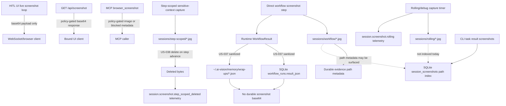

# Screenshot Retention Cleanup And Evidence Audit Scratch Pad

Date: 2026-05-02

Status: investigation scratch pad

Related work:

- `US-035` / `RF-017`: Screenshot security policy design
- `US-036` / `RF-018`: Screenshot payload contract
- `US-037` / `RF-019`: Screenshot persistence sanitization
- `US-038` / `RF-020`: Screenshot capture policy gate

## Purpose

Define the next screenshot workflow branch before promotion into a Forge story.

This scratch pad answers four questions:

1. Where are screenshots currently stored?
2. Who, what, and when causes the system to take screenshots?
3. What does screenshot retention cleanup mean?
4. What does evidence audit mean?

This is not a runtime implementation artifact. Runtime story artifacts belong under `docs/artifacts/` after this work is promoted.

## Current Screenshot Storage Graph

## Current Storage Locations

| Location | Current role | Screenshot bytes? | Indexed? | Retention status |
| --- | --- | --- | --- | --- |
| HITL WebSocket payload | Live operator/agent view | yes, transient | no | ephemeral |
| `GET /api/screenshot` response | On-demand UI screenshot | yes, transient | no | ephemeral |
| MCP screenshot response | On-demand MCP screenshot | yes when allowed | no | ephemeral unless caller stores it |
| `sessions/workflow/*.jpg` | Direct workflow evidence screenshot files | yes | path metadata in workflow result/wrap-up | `keep_until_manual_review` by policy |
| `workflow_runs.result_json` | Durable workflow result JSON | no base64 after `US-037` | yes | path plus metadata only |
| `~/.ai-vision/memory/wrap-ups/*.json` | Durable wrap-up artifact | no base64 after `US-037` | file artifact | path plus metadata only |
| `sessions/rolling/*.jpg` | Rolling/debug frames | yes | no | needs Story E cleanup |
| `sessions/step-scoped/*.jpg` | Temporary agent-context screenshots | yes, short-lived | no | deleted on step advance by `US-038` |
| `session_screenshots` | Legacy/session screenshot path index | path only | yes | metadata only, no policy fields today |
| memory story Markdown/JSON | Narrative run summary | no screenshot bytes expected | file artifact | summary only |

## Who, What, And When Screenshots Are Taken

### Who

Capture initiators today are system actors, not authenticated human users:

- `ui`: HITL browser client or `/api/screenshot`
- `mcp`: MCP `browser_screenshot` caller
- `workflow`: direct workflow `screenshot` step
- `rolling`: session manager rolling/debug timer
- `browser_use_action`: browser-use action callback screenshot payloads
- `session_manager`: shared browser/session layer

Evidence audit actor identity for v1 should use:

- active `sessionId`
- bound UI `clientId` when available
- request IP and user-agent when available
- source actor (`ui`, `mcp`, `workflow`, `rolling`, etc.)
- optional operator label in a later UI story

Do not block Story E on a full auth system.

### What

Each screenshot decision should be described by metadata, not durable bytes:

- source actor
- access path
- screenshot class
- retention mode
- sensitivity state
- session id
- workflow id
- step id
- path if a file exists
- deletion or retention reason
- whether redaction was applied
- whether bytes were deleted

Durable stores must not contain screenshot base64.

### When

Known capture moments:

1. HITL UI screenshot loop while awaiting human/operator state.
2. `GET /api/screenshot` on demand from a bound UI client.
3. MCP `browser_screenshot` calls.
4. Direct workflow `screenshot` steps.
5. Browser-use action screenshot callbacks.
6. Rolling/debug screenshot timer.
7. Step-scoped sensitive-context screenshots allowed by policy and deleted on step advance.
8. Final workflow screenshot steps after successful publication/confirmation workflows.

## Screenshot Retention Cleanup Definition

Screenshot retention cleanup means deleting screenshot bytes according to their retention class while preserving safe metadata and audit records.

Story E should focus on rolling/debug cleanup first.

### Cleanup Rules

| Class / retention | Cleanup rule | Metadata after cleanup |
| --- | --- | --- |
| `live_frame` / `ephemeral` | no file should be retained by platform | optional telemetry only |
| `step_scoped` / `step_scoped` | delete on workflow step advance | deletion telemetry with count/path metadata |
| `debug_frame` / `delete_on_success` | delete on successful wrap-up unless debug retention is enabled | cleanup telemetry with count/path metadata |
| `debug_frame` / `ttl_24h` | retain for failed/debug runs until TTL expires | cleanup telemetry when TTL deletes |
| `evidence` / `keep_until_manual_review` | do not auto-delete | evidence audit required before deletion |
| `sensitive_blocked` / `ephemeral` | no image file should exist | blocked telemetry only |

### Cleanup Story E In Scope

- Delete rolling/debug screenshots on successful wrap-up unless debug retention is explicitly enabled.
- Apply `ttl_24h` cleanup to failed/debug rolling artifacts.
- Keep rolling screenshots out of `session_screenshots` unless a later indexing story explicitly changes that.
- Emit byte-free cleanup telemetry with counts and paths.
- Verify step-scoped deletion remains intact but do not re-own the US-038 behavior.

### Cleanup Story E Out Of Scope

- Capture-time blocking/redaction from `US-038`.
- Durable base64 sanitization from `US-037`.
- Payload contract changes from `US-036`.
- Encryption-at-rest implementation.
- Historical migration of old screenshot artifacts.
- Agentic/orchestrator output guard rail unless `mode: agentic` remains in production screenshot use.

## Evidence Audit Definition

Evidence audit means a durable, queryable record of manual-review actions taken against retained evidence screenshots.

Evidence screenshots use `keep_until_manual_review` by default. They should not be deleted by automatic debug cleanup.

### SQLite Audit Store

Use a first-class SQLite table for evidence audit records.

Recommended table concept:

| Field | Meaning |
| --- | --- |
| `id` | unique audit record id |
| `session_id` | run/session id |
| `workflow_id` | workflow id |
| `step_id` | screenshot-producing step id |
| `screenshot_path` | path to evidence screenshot |
| `screenshot_class` | expected `evidence` |
| `retention` | expected `keep_until_manual_review` |
| `action` | `reviewed`, `retained`, `deleted`, `rejected`, or `exported` |
| `actor_source` | `ui`, `mcp`, `workflow`, or system actor |
| `actor_client_id` | bound UI client id when available |
| `actor_session_id` | active session id when available |
| `actor_ip` | request IP if available |
| `actor_user_agent` | request user-agent if available |
| `reason` | required human/system reason |
| `content_hash` | optional hash of file before deletion/export |
| `created_at` | audit timestamp |

Audit records must not include screenshot bytes.

### Evidence Deletion Rule

Manual evidence deletion must fail closed unless all required metadata exists:

- actor identity metadata
- session id
- workflow id
- screenshot path
- action
- reason
- timestamp

Deleting evidence should emit:

1. SQLite audit row
2. byte-free telemetry event
3. file deletion result

If file deletion fails after audit intent is recorded, emit a failure telemetry event and keep the audit row marked with failed deletion details.

## Edge Case Reconciliation

This section reconciles the implementation risks raised during Story E planning.

### Accepted Findings

| Finding | Classification | Story E action |
| --- | --- | --- |
| Step-scoped reader race | guard rail | Do not make evidence audit depend on step-scoped files. Audit and manual review apply only to evidence screenshots, not `step_scoped` transient files. |
| Partial cleanup failures | in scope | Add durable failed-deletion retry state so failed `unlink` attempts are not swallowed or forgotten. |
| Startup cleanup latency | in scope | Make startup cleanup bounded, resumable, and non-blocking for browser/session availability. |
| Rolling/debug crash retention | in scope | Add startup and wrap-up scavenger cleanup for rolling/debug files, including files older than policy TTL. |
| Intent/action deletion drift | in scope | Add `pending_deletion`, `deleted`, and `delete_failed` states. Never record final `deleted` before post-unlink verification. |
| Path mutation | in scope | Add stable evidence id and capture-time `content_hash` so path is not the only audit identity. |
| System clock skew | in scope | Store UTC timestamps and prefer database-created timestamps where possible; use monotonic ordering only for local process sequencing, not cross-system truth. |
| Zombified workflow screenshot | in scope | Add a scavenger that reconciles workflow screenshot files with SQLite/wrap-up anchors and classifies orphaned files. |
| Duplicate or weak session ids | in scope | Require UUID v4 for new audit-run/evidence ids and avoid relying on `wf-${Date.now()}` as the sole durable audit identity. |
| Multi-client deletion conflict | in scope | Add WebSocket invalidation event for evidence deletion so clients purge local caches/state. |
| Telemetry bloat | in scope | Emit aggregate cleanup telemetry by batch with counts/categories, not one event per file. |

### TTL Precedence Decision

TTL cleanup must not rely on filesystem `mtime` alone.

Precedence:

1. use session end timestamp when the file can be tied to a completed session;
2. use capture timestamp from metadata, audit record, or filename-derived timestamp when session state is unavailable;
3. use filesystem `mtime` only as the fallback signal for orphaned files discovered by scavenger logic.

Reason: `mtime` can change during backup, restore, copy, or touch/chmod operations. Session end time better matches `delete_on_success` and `ttl_24h` semantics. For orphaned files with no durable anchor, `mtime` remains an operational fallback.

### Reconciliation Action Steps

1. Promote Story E as `US-039 / RF-021: Screenshot Retention Cleanup, Scavenger, And Evidence Audit`.
2. Add a bounded startup scavenger and targeted wrap-up scavenger.
3. Add durable failed-deletion retry/dead-letter state.
4. Add evidence audit states: `reviewed`, `retained`, `pending_deletion`, `deleted`, `delete_failed`, `rejected`, and `exported`.
5. Generate stable evidence ids and capture-time content hashes for evidence screenshots.
6. Add WebSocket evidence invalidation events after verified deletion.
7. Require UUID v4 or equivalent stable audit ids for new evidence/audit rows.
8. Aggregate cleanup telemetry without screenshot bytes.

## Candidate Story E Shape

Possible title:

`US-039 / RF-021: Screenshot Retention Cleanup, Scavenger, And Evidence Audit`

Owns:

1. rolling/debug delete-on-success cleanup
2. rolling/debug `ttl_24h` cleanup path
3. bounded startup and wrap-up scavenger
4. failed-deletion retry/dead-letter state
5. evidence audit SQLite table
6. manual evidence action audit contract
7. stable evidence ids and capture-time content hashes
8. WebSocket invalidation for deleted evidence
9. cleanup telemetry without image bytes
10. storage graph and documentation alignment

Does not own:

1. screenshot capture gates
2. sensitive-region redaction
3. base64 persistence sanitization
4. evidence encryption
5. historical migration
6. agentic/orchestrator output guard rail

## Open Questions For Story Promotion

- Should debug retention be controlled by an environment variable such as `AI_VISION_RETAIN_DEBUG_SCREENSHOTS=true`?
- Should TTL cleanup run synchronously during wrap-up, at startup, or both?
- Should evidence audit actions expose an HTTP endpoint now, or only repository/service functions for the first implementation story?
- Should `session_screenshots` remain legacy path-only, or should evidence audit become the preferred query surface for screenshot evidence?

## Recommended Defaults

- Debug retention opt-in via environment variable.
- Cleanup runs at wrap-up and startup.
- Evidence audit v1 starts with repository/service functions plus tests; UI endpoint can be a later story if no deletion UI exists yet.
- `session_screenshots` remains path-only until a separate normalization story.

## Implementation Closeout

`US-039 / RF-021` is implemented.

Runtime ownership:

- `src/session/screenshot-retention.ts` owns TTL decisions, bounded startup scavenging, wrap-up cleanup, evidence audit writes, verified evidence deletion, content hashing, and cleanup telemetry.
- `src/db/migrations/004_screenshot_evidence_audit.sql` adds `screenshot_evidence_audit` and `screenshot_cleanup_failures`.
- `src/workflow/engine.ts` assigns evidence ids and capture-time hashes to workflow evidence screenshots.
- `src/workflow/wrap-up.ts` audits retained evidence and deletes non-evidence screenshots during successful wrap-up.
- `src/session/manager.ts` starts the bounded startup scavenger off the browser startup path, records step-scoped cleanup failures, and emits verified evidence deletion invalidation events.
- `src/ui/server.ts` broadcasts `screenshot_deleted` so bound clients clear stale screenshot state.

Closed action steps:

1. Rolling/debug cleanup implemented at successful wrap-up for workflow-owned non-evidence screenshots.
2. `ttl_24h` startup cleanup implemented for rolling/debug leftovers with bounded batch size.
3. Failed deletion state is durable in `screenshot_cleanup_failures`.
4. Evidence audit records stable evidence id, path, hash, action, actor, reason, session, workflow, and step metadata without bytes.
5. Evidence deletion writes `pending_deletion`, verifies unlink, then writes `deleted` or `delete_failed`.
6. WebSocket invalidation is emitted after verified evidence deletion.
7. Step-scoped screenshots remain transient and outside manual evidence review.

Validation:

- `jq empty prd.json` passed.
- `pnpm run typecheck` passed.
- `pnpm test -- --runInBand src/session/manager.test.ts src/workflow/wrap-up.test.ts` passed: 2/2 suites, 7/7 tests.
